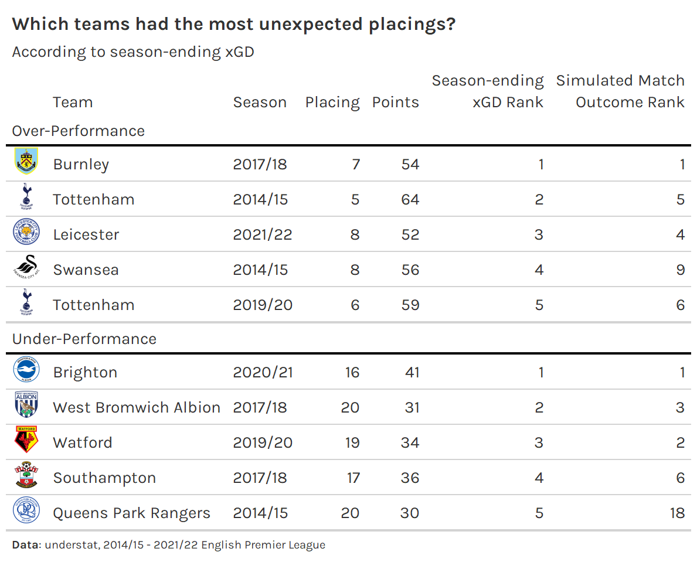
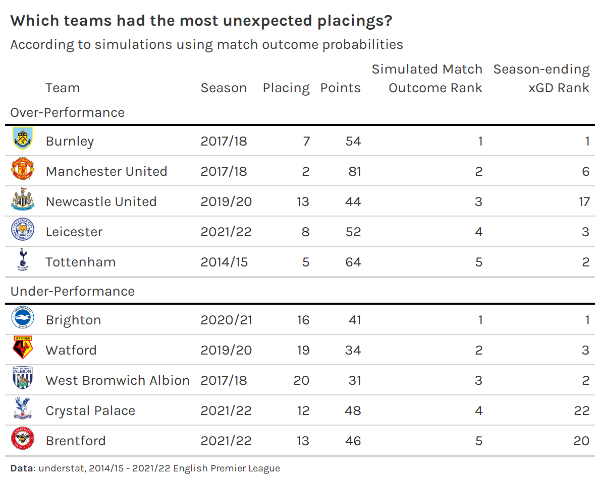

```{r}
#| label: setup,
#| include: FALSE
#| echo: FALSE
knitr::opts_chunk$set(
  include = TRUE,
  echo = TRUE,
  cache = FALSE,
  eval = FALSE,
  cache.lazy = FALSE,
  fig.show = 'hide',
  fig.align = 'center',
  fig.width = 8,
  fig.asp = 0.75,
  fig.retina = 2,
  warning = FALSE,
  message = FALSE
)
```

## Introduction

I'll be picking up where I left off in [my last post](https://tonyelhabr.rbind.io//post/epl-xpts-simulation-1), so stop everything that you're doing and go read that if you haven't already. In this post we'll do two things:

1.  We'll compare how well season-level expected goal difference (xGD), season-level xPts, and aggregated match-level xPts predict season-long points for a given team.

2.  We'll use the match-level probabilites to answer the questions "Which teams had the most unlikely placings in the table given the quality of all their shots across the season?" and "How unlikely were such placings?"

## Analysis

### 1. Predicting season-long points

#### With season-long xPts and xGD

We start with the `all_raw_understat_xpts_by_match` variable from the prior post, adding the opponent's expected goals to create a column for expected goal difference (`xgd`).

```{r}
#| label: all_raw_understat_xpts_xgd_by_match
#| eval: false
all_raw_understat_xpts_by_match_with_opponent <- all_raw_understat_xpts_by_match |> 
  inner_join(
    all_understat_shots |> distinct(match_id, season, date, team, opponent),
    by = c('season', 'date', 'team')
  )

## we've already determined that the raw_xpts (provided directly by understat) 
##   is close to our calculated xpts, so we'll just use the raw_xpts.
all_raw_understat_xpts_xgd_by_match <- all_raw_understat_xpts_by_match_with_opponent |> 
  select(match_id, season, date, team, opponent, pts, xpts = raw_xpts, xg) |> 
  inner_join(
    all_raw_understat_xpts_by_match_with_opponent |> 
      select(match_id, opponent = team, opponent_xg = xg),
    by = c('match_id', 'opponent')
  ) |> 
  mutate(xgd = xg - opponent_xg)
```

Next, we aggregate up to the season-level.

```{r}
#| label: all_raw_understat_xpts_xgd_by_season
#| eval: false
all_raw_understat_xpts_xgd_by_season <- all_raw_understat_xpts_xgd_by_match |> 
  group_by(season, team) |> 
  summarize(across(c(pts, xpts, xgd), sum)) |> 
  ungroup() |> 
  group_by(season) |> 
  mutate(xrank = row_number(desc(xpts))) |> 
  ungroup() |> 
  arrange(season, desc(pts), team)
```

Finally, we compute RMSE and R squared, like we did in the last post.

```{r}
#| label: diagnose_season_feature
#| eval: false
diagnose_season_feature <- function(df, col) {
  fit <- lm(df$pts ~ df[[col]])
  tibble(
    rmse = compute_rmse(df$pts, predict(fit)),
    r2 = summary(fit)$r.squared
  )
}

c('xgd', 'xpts') |> 
  set_names() |> 
  map_dfr(
    ~diagnose_season_feature(all_raw_understat_xpts_xgd_by_season, .x), 
    .id = 'feature'
  )
#> # A tibble: 2 × 3
#>   feature  rmse    r2
#>   <chr>   <dbl> <dbl>
#> 1 xgd      7.31 0.831
#> 2 xpts     7.19 0.837
```

As we should expect, a model using season-long xPts to predict final points outperforms one using season-long xGD as a feature, although maybe the difference between the two is smaller than we might have expected.

#### With match-level outcome probabilities

First, we use the full understat shot data set and the custom functions from the prior post to calculate xPts by match.

```{r}
#| label: all_understat_xpts_by_match
#| eval: false
all_understat_xpts_by_match <- all_understat_shots |> 
  calculate_permuted_xg() |> 
  summarize_permuted_xg_by_match()
```

Then, before we move on, we need to handle an edge case: some teams do not have any shots in some matches.[^1] We choose to specify that that a probability of 0.9 to losing and 0.1 to drawing for such teams.[^2]

[^1]: Theoretically, there is an even more extreme case: when both teams do not have any shots in a match. This does not occur in the data set, so we do not need to correct for this.

[^2]: These choices are purely based on intuition. We could be more rigorous about this, but I think these defaults should be fine. It's wrong to assign a probability of 1 for losing, and a naive split of 0.5 and 0.5 for losing and drawing is surely too optimistic in favor of drawing.

```{r}
#| label: all_understat_probs_by_match
#| eval: false
init_all_understat_probs_by_match <- all_understat_xpts_by_match |> 
  select(match_id, season, team, opponent, is_home, starts_with('prob')) |> 
  rename_with(~str_remove(.x, '^prob_'), starts_with('prob')) |> 
  pivot_longer(
    c(win, lose, draw),
    names_to = 'result',
    values_to = 'prob'
  )

understat_guaranteed_wins <- init_all_understat_probs_by_match |> 
  group_by(team, match_id) |> 
  filter(all(prob == 1)) |> 
  ungroup()

understat_guaranteed_losses <- init_all_understat_probs_by_match |> 
  group_by(team, match_id) |> 
  filter(all(prob == 0)) |> 
  ungroup()

understat_probs_by_match <- init_all_understat_probs_by_match |> 
  anti_join(
    understat_guaranteed_losses |> select(team, match_id, result),
    by = c('team', 'match_id', 'result')
  ) |> 
  bind_rows(
    understat_guaranteed_wins |> 
      mutate(
        prob = case_when(
          result == 'win' ~ 0.9,
          result == 'lose' ~ 0,
          result == 'draw' ~ 0.1
        )
      )
  ) |> 
  bind_rows(
    understat_guaranteed_losses |> 
      mutate(
        prob = case_when(
          result == 'win' ~ 0,
          result == 'lose' ~ 0.9,
          result == 'draw' ~ 0.1
        )
      )
  ) |> 
  arrange(season, team, match_id)
```

Next, the fun part: simulating match outcomes using the xG-implied match outcome probabilities. This is computationally intense, so we parallelize the calculation.

```{r}
#| label: understat_sim_pts_by_season
#| eval: false
library(parallel)
library(future)
library(furrr)

simulate_season_xpts <- function(...) {
  sim_home_pts_by_match <- understat_probs_by_match |> 
    filter(is_home) |> 
    group_by(team, season, match_id) |> 
    slice_sample(n = 1, weight_by = prob) |> 
    ungroup() |>
    mutate(
      pts = case_when(
        result == 'win' ~ 3L,
        result == 'lose' ~ 0L,
        TRUE ~ 1L
      )
    )
  
  sim_pts_by_match <- bind_rows(
    sim_home_pts_by_match |> select(match_id, season, team, pts),
    sim_home_pts_by_match |> 
      transmute(
        match_id,
        season,
        team = opponent,
        pts = case_when(
          result == 'win' ~ 0L,
          result == 'lose' ~ 3L,
          TRUE ~ 1L
        )
      )
  ) |> 
    group_by(season, team) |> 
    summarize(across(pts, sum)) |> 
    ungroup()
  
  sim_pts_by_match |> 
    group_by(season, team) |> 
    summarize(across(pts, sum)) |> 
    ungroup() |> 
    group_by(season) |> 
    mutate(rank = row_number(desc(pts))) |> 
    ungroup() |> 
    arrange(season, rank)
}

n_cores <- detectCores()
cores_for_parallel <- ceiling(n_cores * 0.5)
plan(
  multisession,
  workers = cores_for_parallel
)

set.seed(42)
n_sims <- 10000
understat_sim_pts_by_season <- set_names(1:n_sims) |> 
  future_map_dfr(
    simulate_season_xpts, 
    .id = 'sim_idx', 
    .options = furrr_options(seed = 42)
  )

## back to normal processing
plan(sequential)
```

Next, we aggregate the season-long points across simulations, calculating the relative proportion of simulations in which a given team ends up at a given rank.

```{r}
#| label: understat_sim_placings
#| eval: false
understat_sim_placings <- understat_sim_pts_by_season |> 
  group_by(season, team, xrank = rank) |> 
  summarize(n = n(), xpts = mean(pts)) |> 
  ungroup() |> 
  group_by(season, team) |> 
  mutate(prop = n / sum(n)) |> 
  ungroup()
```

```{r}
#| label: understat_sim_placings-2
#| eval: false
#| include: false
understat_sim_placings <- understat_sim_placings |> 
  arrange(season, team, desc(xrank)) |> 
  group_by(season, team) |> 
  mutate(inv_cumu_prop = cumsum(prop)) |> 
  ungroup() |> 
  arrange(season, team, xrank) |> 
  group_by(season, team) |> 
  mutate(
    cumu_prop = cumsum(prop),
    .before = inv_cumu_prop
  ) |> 
  ungroup()
```

Finally, we calculate the weighted average of expected points that a team ends up with, and run the same regression that we ran earlier with season-long xPts and xGD.

```{r}
#| label: understat_sim_placings_agg
#| eval: false
understat_sim_placings_agg <- understat_sim_placings |> 
  group_by(season, team) |> 
  summarize(xpts = sum(xpts * prop)) |> 
  ungroup() |>
  select(season, team, xpts) |>
  inner_join(
    all_raw_understat_xpts_xgd_by_season |> select(season, team, pts),
    by = c('season', 'team')
  ) |> 
  arrange(season, desc(xpts))

diagnose_season_feature(understat_sim_placings_agg, 'xpts')
#> # A tibble: 1 × 2
#>    rmse    r2
#>   <dbl> <dbl>
#> 1  7.14 0.839
```

Interestingly, the RMSE and R squared values are almost identical to those for the season-long xPts. I think this is not too surprising---match-level outcome probabilities simulated to get season-long xPts should give us something very close to just computing season-long xPts directly.

All that work just to arrive at a null result was not for nothing---we may still leverage the match-level probabilities in a useful manner for season-long insights. In particular we can use the the relative proportion of simulations in which a given team ends up at a given rank to identify which actual end-of-season placings were the most unexpected.

### 2. Identifying un-expected placings

First, we need to step back and retrieve data on the actual placings. We could theoretically calculate this from the shot data we already have. However, the logic for handling own goals is a little complicated. We're probably better off using `worldfootballR::understat_league_match_results()`---which returns goals at the match-level---to calculate the table. [^3]

[^3]: Maybe even more simply, we could use `worldfootballR::fb_season_team_stats(..., stat_type = 'league_table')`, although we'd need to add a column for team names for [FBref](https://fbref.com/en/) to our team mapping to corroborate team names.

```{r}
#| label: table
#| eval: false
match_results <- 2014:2021 |> 
  map_dfr(~understat_league_match_results('EPL', .x)) |> 
  as_tibble()

init_table <- match_results |> 
  transmute(
    match_id,
    across(season, ~str_replace(.x, '\\/20', '/')),
    date = strptime(datetime, '%Y-%m-%d %H:%M:%S', tz = 'UTC') |> date(),
    home_team,
    home_goals,
    away_team,
    away_goals
  )

table <- bind_rows(
  init_table |>
    mutate(is_home = TRUE) |> 
    rename_home_away_teams() |> 
    select(season, team, opponent, goals = home_goals, opponent_goals = away_goals),
  init_table |> 
    mutate(is_home = FALSE) |> 
    rename_home_away_teams() |> 
    select(season, team, opponent, goals = away_goals,opponent_goals = home_goals)
) |> 
  mutate(
    pts = case_when(
      goals > opponent_goals ~ 3L,
      goals < opponent_goals ~ 0L,
      TRUE ~ 1L
    )
  ) |> 
  group_by(season, team) |> 
  summarize(across(c(goals, opponent_goals, pts), sum)) |> 
  ungroup() |> 
  mutate(gd = goals - opponent_goals) |> 
  arrange(season, desc(pts), desc(gd)) |> 
  group_by(season) |> 
  mutate(rank = row_number(desc(pts))) |> 
  ungroup() |> 
  arrange(season, rank)
```

Next, we join the `table` of end-of-season placements (`actual_rank`) to the simulation results that are ***not*** aggregated to a single `xrank` per team (`understat_sim_placings` instead of `understat_sim_placings_agg`).

```{r}
#| label: understat_sim_placings_with_actual_ranks
#| eval: false
understat_sim_placings_with_actual_ranks <- understat_sim_placings |> 
  inner_join(
    table |> select(season, team, actual_pts = pts, actual_rank = rank),
    by = c('season', 'team')
  ) |> 
  inner_join(
    all_raw_understat_xpts_xgd_by_season |> 
      select(season, team, actual_xpts = xpts, xgd),
    by = c('season', 'team')
  )
```

Finally, to identify over-achieving teams, we find the teams that had the lowest cumulative probability of placing at their actual placing or better; and to identify under-achieving teams, we find the teams with the lowest cumulative probability of placing at their actual placing or worse.[^4]

[^4]: Table code is not shown since it's not particularly instructive.

```{r}
#| label: unexpected_understat_sim_placings
#| eval: false
#| include: false
slice_top5_sim_placings <- function(which) {
  
  col <- switch(
    which,
    'over' = 'cumu_prop',
    'under' = 'inv_cumu_prop'
  )
  
  understat_sim_placings_with_actual_ranks |> 
    filter(xrank == actual_rank) |> 
    slice_min(.data[[col]], n = 5, with_ties = FALSE) |> 
    mutate(tail_prop = .data[[col]]) |> 
    transmute(
      which,
      unexpected_rank = row_number(.data[[col]]),
      season,
      team,
      actual_rank,
      actual_pts,
      tail_prop
    )
}

unexpected_understat_sim_placings <- c('over', 'under') |> 
  set_names() |> 
  map_dfr(slice_top5_sim_placings, .id = 'which')
```

```{r}
#| label: unexpected_understat_sim_placings-gt
#| eval: false
#| include: false
library(gt)

.gt_theme_538 <- function(data, ...) {
  data |>
    opt_table_font(
      font = list(
        google_font('Karla'),
        default_fonts()
      )
    ) |>
    tab_style(
      style = cell_borders(
        sides = 'bottom', color = 'transparent', weight = px(3)
      ),
      locations = cells_column_labels(
        columns = everything()
      )
    ) |> 
    tab_options(
      column_labels.background.color = 'white',
      heading.border.bottom.style = 'none',
      table.border.top.width = px(3),
      table.border.top.style = 'none',
      column_labels.font.weight = 'normal',
      column_labels.border.top.style = 'none',
      column_labels.border.bottom.width = px(2),
      column_labels.border.bottom.color = 'black',
      stub.border.color = 'white',
      stub.border.width = px(0),
      data_row.padding = px(0),
      source_notes.font.size = 10,
      source_notes.border.lr.style = 'none',
      table.font.size = 14,
      heading.title.font.size = 16,
      heading.subtitle.font.size = 14,
      heading.align = 'left',
      heading.title.font.weight = 'italic',
      footnotes.font.size = 10,
      footnotes.padding = px(0),
      row_group.padding = px(3),
      row_group.border.bottom.color = 'black',
      table.border.bottom.style = 'none',
      ...
    )
}

prep_tb <- function(df) {
  df |> 
    inner_join(
      team_mapping |> select(team_understat, url_logo_espn),
      by = c('team' = 'team_understat')
    ) |> 
    relocate(url_logo_espn, .before = team) |> 
    relocate(season, .after = team) |> 
    mutate(
      across(which, ~ifelse(.x == 'over', 'Over-Performance', 'Under-Performance'))
    )
}

common_gt_styling <- function(tb) {
  tb |> 
    text_transform(
      locations = cells_body(columns = url_logo_espn),
      fn = function(x) {
        web_image(
          url = x,
          height = 25
        )
      }
    ) |>
    tab_style(
      locations = cells_column_labels(),
      style = list(
        'padding-bottom: 0px; padding-top: 0px; padding-left: 5px; padding-right: 5px'
      )
    ) |> 
    tab_source_note(
      source_note = md('**Data**: understat, 2014/15 - 2021/22 English Premier League')
    )
}

tb <- unexpected_understat_sim_placings |> 
  prep_tb() |> 
  select(
    which,
    unexpected_rank,
    url_logo_espn,
    team,
    season,
    actual_rank,
    actual_pts,
    tail_prop
  ) |> 
  group_by(which) |> 
  gt() |> 
  .gt_theme_538() |> 
  common_gt_styling() |> 
  cols_label(
    unexpected_rank = ' ',
    url_logo_espn = ' ',
    team = 'Team',
    season = 'Season',
    actual_rank = 'Placing',
    actual_pts = 'Points',
    tail_prop = 'Prob.'
  ) |> 
  fmt_percent(
    columns = tail_prop,
    decimals = 1
  ) |> 
  tab_footnote(
    locations = cells_column_labels(tail_prop),
    footnote = 'Given the team\'s shot-by-shot xG for the entire season, the tail probability of the team achieving the placing that they actually achieved.',
  ) |> 
  tab_header(
    title = md('**Which teams had the most unexpected placings?**'),
    subtitle = md('According to simulations using match outcome probabilities')
  )
tb

gtsave(
  tb,
  vwidth = 500,
  # zoom = 2,
  filename = '_post/epl-xpts-simulation-2/unexpected.png'
)
```


This table certainly passes the eye test. Brighton's sixteenth place finish in the 2020/21 season was discussed ad nauseum in the analytics sphere. Brighton under-performed historically given their massively positive xGD.

On the other end of the spectrum, it's not hyperbole to say that Manchester United's second place finish in the 2017/18 season was an under-achievement. Although they ended up with the third best goal differential that season, they were closely followed by several teams. And their xGD was sixth in the league that season.

#### Comparison with a simpler approach

Notably, we could get somewhat similar results by simply looking at the largest residuals of a model that regresses the actual final table placing on just xGD, which is how most people tend to think of "unexpected placings".

```{r}
#| label: xgd_rank_fit
#| eval: false
table_with_xgd <- table |> 
  select(season, team, actual_pts = pts, actual_rank = rank) |> 
  inner_join(
    all_raw_understat_xpts_xgd_by_season |> select(season, team, xgd),
    by = c('season', 'team')
  )

xgd_rank_fit <- lm(actual_rank ~ xgd, table_with_xgd)
```

```{r}
#| label: xgd_rank_preds
#| eval: false
#| include: false
table_with_xgd_xpts <- table_with_xgd |> 
  inner_join(
    all_raw_understat_xpts_xgd_by_season |> select(season, team, xpts),
    by = c('season', 'team')
  )

library(broom)
xgd_rank_preds <- xgd_rank_fit |> 
  augment_columns(table_with_xgd_xpts) |> 
  transmute(
    season,
    team,
    actual_rank,
    actual_pts,
    xgd,
    xpts,
    .pred = .fitted,
    .resid,
    .std.resid,
    xgd_unexpected_rank = row_number(.resid),
    inv_xgd_unexpected_rank = row_number(desc(.resid)),
    xgd_tail_prop = pnorm(.std.resid),
    inv_xgd_tail_prop = pnorm(desc(.std.resid))
  )
```

```{r}
#| label: slice_top5_xgd_resids
#| eval: false
#| include: false
slice_top5_xgd_resids <- function(which) {
  
  if (which == 'over') {
    slice_f <- slice_min
    op <- 1
    col <- 'xgd_unexpected_rank'
    col_sim <- 'cumu_prop'
  } else {
    slice_f <- slice_max
    op <- -1
    col <- 'inv_xgd_unexpected_rank'
    col_sim <- 'inv_cumu_prop'
  }
  
  xgd_rank_preds |> 
    slice_f(.resid, n = 5, with_ties = FALSE) |> 
    transmute(
      season,
      team,
      actual_rank,
      actual_pts,
      xgd_unexpected_rank = row_number(op * .resid)
    ) |> 
    inner_join(
      understat_sim_placings_with_actual_ranks |> 
        filter(xrank == actual_rank) |> 
        mutate(tail_prop = .data[[col_sim]]) |> 
        transmute(
          season, 
          team, 
          unexpected_rank = row_number(.data[[col_sim]])
        ),
      by = c('season', 'team')
    ) |> 
    arrange(xgd_unexpected_rank)
}

tb_xgd_unexpected <- c('over', 'under') |> 
  set_names() |> 
  map_dfr(slice_top5_xgd_resids, .id = 'which') |> 
  prep_tb() |> 
  select(
    which,
    url_logo_espn,
    team,
    season,
    actual_rank,
    actual_pts,
    xgd_unexpected_rank,
    unexpected_rank
  ) |> 
  group_by(which) |> 
  gt() |> 
  .gt_theme_538() |> 
  common_gt_styling() |> 
  cols_label(
    unexpected_rank = ' ',
    url_logo_espn = ' ',
    team = 'Team',
    season = 'Season',
    actual_rank = 'Placing',
    actual_pts = 'Points',
    xgd_unexpected_rank = gt::html('Season-ending<br/>xGD Rank'),
    unexpected_rank = gt::html('Simulated Match<br/>Outcome Rank')
  ) |> 
  tab_header(
    title = md('**Which teams had the most unexpected placings?**'),
    subtitle = md('According to season-ending xGD')
  )
tb_xgd_unexpected

gtsave(
  tb_xgd_unexpected,
  vwidth = 650,
  # zoom = 2,
  filename = '_post/epl-xpts-simulation-2/xgd_unexpected.png'
)
```

The table below shows the top five over- and under-achieving teams according to our regression explaining season-ending placing with season-ending xGD. Three of the top five over- and under-performing teams appear in the respective top fives according to the ranks from the simulations of match probabilities shown before.



```{r}
#| label: slice_xgd_resids_matching_top5_sim_placings
#| eval: false
#| include: false
slice_xgd_resids_matching_top5_sim_placings <- function(which) {
  
  col <- switch(
    which,
    'over' = 'xgd_unexpected_rank',
    'under' = 'inv_xgd_unexpected_rank'
  )
  
  unexpected_understat_sim_placings |> 
    filter(which == !!which) |> 
    transmute(season, team, unexpected_rank) |> 
    inner_join(
      xgd_rank_preds |> 
        select(season, team, actual_rank, actual_pts, xgd_unexpected_rank = .data[[col]]),
      by = c('season', 'team')
    )
}

tb_matching_unexpected <- c('over', 'under') |> 
  set_names() |> 
  map_dfr(slice_xgd_resids_matching_top5_sim_placings, .id = 'which') |> 
  prep_tb() |> 
  select(
    which,
    url_logo_espn,
    team,
    season,
    actual_rank,
    actual_pts,
    unexpected_rank,
    xgd_unexpected_rank
  ) |> 
  group_by(which) |> 
  gt() |> 
  .gt_theme_538() |> 
  common_gt_styling() |> 
  cols_label(
    unexpected_rank = ' ',
    url_logo_espn = ' ',
    team = 'Team',
    season = 'Season',
    actual_rank = 'Placing',
    actual_pts = 'Points',
    unexpected_rank = gt::html('Simulated Match<br/>Outcome Rank'),
    xgd_unexpected_rank = gt::html('Season-ending<br/>xGD Rank')
  ) |> 
  tab_header(
    title = md('**Which teams had the most unexpected placings?**'),
    subtitle = md('According to simulations using match outcome probabilities')
  )
tb_matching_unexpected

gtsave(
  tb_matching_unexpected,
  vwidth = 650,
  # zoom = 2,
  filename = '_post/epl-xpts-simulation-2/xgd_matching_unexpected.png'
)
```

We can also look at this from the opposite perspective. Where do the top five over- and under-achievers according to our simulations with match outcome probabilities fall among the season-ending xGD unexpected ranks?



As shown by the prior table, three team-season pairs in each group appear in the top five when ranked by the likelihood resulting from match probabilities or by the season-ending xGD regression. Overall, we might say that the two methods produce similar results.

```{r}
# inv_xgd_unexpected_rank
xgd_rank_preds |> 
  transmute(
    season,
    team,
    actual_rank,
    actual_pts,
    xgd,
    xpts,
    xgd_unexpected_rank = inv_xgd_unexpected_rank,
    xgd_tail_prop = inv_xgd_tail_prop
  ) |> 
  filter(
    xgd_unexpected_rank <= 80
  ) |> 
  inner_join(
    understat_sim_placings_with_actual_ranks |> 
      filter(xrank == actual_rank) |> 
      mutate(tail_prop = .data[[col_sim]]) |> 
      transmute(
        season, 
        team, 
        tail_prop = inv_cumu_prop ,
        unexpected_rank = row_number(inv_cumu_prop)
      ),
    by = c('season', 'team')
  ) |> 
  mutate(
    diff_rank = xgd_unexpected_rank - unexpected_rank,
    diff_prop = xgd_tail_prop - tail_prop
  ) |> 
  filter(
    unexpected_rank < xgd_unexpected_rank,
  ) |> 
  slice_max(abs(diff_prop), n = 5, with_ties = FALSE) |> 
  arrange(desc(abs(diff_prop)))
```

However, there are some big differences between the two methods once we look outside the top five or so biggest over- and under- achievers. For example, in terms of over-achieving, Arsenal's fifth place finish 2018/19 season is given just a 8.9% chance of occurring given their season-long xGD, ranking them at 16th among 80 team-season pairs considered to have over-achieved from 2014/15.[^5][^6] On the other hand, the match-level simulation approach marks the likelihood of them finishing fourth as 31.9% (38th of 180). The season-long xGD model essentially sees that they finished with an xGD of 7.5---less than any other fifth place finisher from 2014/15 - 2021/22---and penalizes them, while the match-level approach contextualizes them among their competition more robustly.

[^5]: Any team with a residual less than 0 is considered to have over-achieved. Note that there are 160 team-season pairs in the data set, so a split of 80 and 80 teams classified as over- and under-achieving is expected, since a linear regression model cannot perfectly predict a team's placing with just a singular feature.

[^6]: To quantify the likelihood of a team's placing with the simple regresion, we convert the standard residual of the regression to a tail probability.

As another example, Manchester United's under-achieving sixth place finish in the 2016/17 is given a fairly reasonable 37.3% chance (66th of 80 under-achieving teams) of occurring given their season-long 25.9 xGD, most for any sixth place team in the data set. On the other hand, the match-level simulation approach sees their sixth place finish as more unlikely, at just a 15.4% probability (15th of 80). While one might have their own opinion regarding which approach seems more "correct", I'd say that likelihoods from the simulation approach seem more appropriate for extreme examples.

Overall, both approaches seem reasonable to use to answer the question "Which teams had the most unlikely placings in the table given the quality of all their shots across the season?" But the approach based on simulations using match probabilities seems more appropriate to use to quantify just how unlikely a team's final placing was. While the simpler regression approach can also be used to quantify likelihood, it is more brittle, dependent on statistical assumptions. Additionally, while it contextualizes a team's xGD with historical xGD, it does not contextualize a team's xGD among the other teams in the league, meaning that it does not do a good job with capturing likelihood when there are strong xGD over- and under-performances among a set of teams in a given season.

## Conclusion

While aggregating match-level outcome probabilities to try to predict season-ending points does no better than more direct approaches with season-long xGD or xPts, simulating seasons using match-level outcome probabilities can be used in a perhaps more interesting way---to quantify just how unlikely a team's placement in the table is, given xG for all of their shots across the season.

```{r}
#| label: printout
#| include: false
#| eval: false
qs::qsave(z, 'z.qs')

library(base)
qs::qread('c:/users/antho/documents/projects/itsmetoeknee/z.qs')
```
