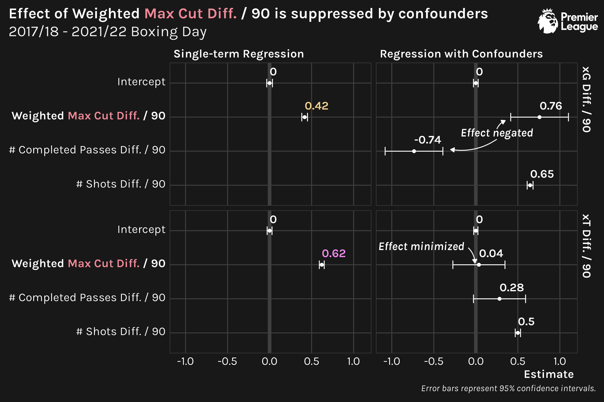

```{r setup, include=F, echo=F, cache=F}
knitr::opts_chunk$set(
  include = TRUE,
  echo = TRUE,
  cache = FALSE,
  eval = FALSE,
  cache.lazy = FALSE,
  fig.show = 'hide',
  fig.align = 'center',
  fig.width = 8,
  fig.asp = 0.75,
  fig.retina = 2,
  warning = FALSE,
  message = FALSE
)
```

## Introduction

[Pass networks](https://www.datofutbol.cl/passing-networks-r/) are a common visualization form used to summarize a team's behavior in a soccer match. Nodes represent average player position on passes that they are involved with, and edges represent passes between players. Most pass networks also weight node size and edge width by the total number of passes.


While pass networks provide a nice visual tool for providing insight that can (and should) be supplemented by more detailed analysis, they're often just that---purely a visual tool. In order to gain meaning beyond just anecdotal insight ("Look at how far the wingbacks were up the field!"), practitioners may leverage graph theory concepts such as [centrality](https://en.wikipedia.org/wiki/Centrality) to quantify relationships.[^1]

[^1]: There are other things researchers have done, such as [subsetting the passes that make up the network based on game situation](https://karun.in/blog/interactive-passing-networks.html), or [supplement the visual with meaningful color](https://statsbomb.com/2018/08/explaining-xgchain-passing-networks/)

Inspired by the findings of Eliakim et al. in ["The development of metrics for measuring the level of symmetry in team formation and ball movement flow, and their association with performance"](https://www.tandfonline.com/doi/abs/10.1080/24733938.2021.1919747), I wanted to evaluate a graph theory concept that has not been explored in relation to soccer pass networks (except for by Eliakim et al.): [maximum cuts](https://en.wikipedia.org/wiki/Maximum_cut).

To do so, I'll be using data from the 2017/18 - 2020/21 Premier League seasons, along with the games up through Boxing Day of the 2021/22 season. Passes and other events are only considered up through the first substitution or red card of each match.

## Examples

### Simple

What is a maximum cut? Visually, it's an arbitrary line that you can draw through the edges of a network that maximizes the sum of the edge weights.


For this example, 15 is actually a *weighted* max cut, since edges are treated differently, according to their assigned value. (An unweighted max cut would assign each edge a value of 1.)

On the other side of things, the min cut would be 2+4=6 for this example.

### In Soccer

A 4-node, 5-edge network is nice for illustration, but how does this bear out in soccer?

To give a soccer example, Here's the pass network and weighted max cut numbers for [the match between Liverpool and Manchester City on October 3, 2021](https://www.fotmob.com/match/3609994/matchfacts/liverpool-vs-manchester-city). [^2]

[^2]: Unfortunately, max cuts can be difficult to visualize for graphs with lots of edges and/or nodes, so reporting just the quantity is often the best thing we can do. 🤷


Zooming out from a single example to all games in our data set, the distribution of weighted max cuts per 90 minutes looks relatively normal, perhaps log-normal. *Note: It's important to adjust for time since not all games have the same number of minutes played due to variance in the occurrence of the first formation change.*


## But is Max Cut Useful?

### Setup

To quantify the impact of weighted max cuts, we'll look at two measures of quality of play.

1.  [**expected goals (xG)**](https://theanalyst.com/na/2021/07/what-are-expected-goals-xg/): xG tells the story of shot quality and quantity, which is massively important in a low-scoring game like soccer.
2.  [**expected threat (xT)**](https://karun.in/blog/expected-threat.html): xT quantifies scoring opportunities more generally, looking beyond shots.

I'd argue that xT is more informative for our purposes since max cut is related to passes and xT accounts for passes; xG is so tied up in shots that their relationship to passes leading up to those shots may be lost. Nonetheless, we'll be considering both since both are commonly used for judging overall "value" in soccer.

We'll be transforming these xG and xT in two manners.

1.  **Volume-adjusting**, i.e. taking each value per 90 minutes. The justification for adjusting max cut for time also applies here.
2.  **Opponent-adjusting**, or "differencing", i.e. subtracting one side's value from the other's value. Sure, having a lot of touches in the opponent's half and taking a lot of shots means scoring is more likely, but if you're also giving up a ton of shots, then that effort is essentially negated.

Given that we'll be making our two quality-of-play stats---xG and xT---relative to the opponent, I prefer to opponent-adjust weighted max cut in the same manner. I'd argue that weighted max cut differential is more informative than just the weighted max cut of one side or the other. Suppressing your opponent's weighted max cut is reflective of limiting their pass volume, and, consequently, makes it more likely that your weighted max cut is higher.

The relationship between weighted max cut and weighted max cut differential is very linear, so, ultimately, it shouldn't matter too much if we look at opponent-adjust weighted max cut versus just raw weighted max cut.


Differencing has the added benefit of making our distributions look more "normal", by making them symmetric about 0. This generally is beneficial for regression analysis, which we go on to conduct.

### Correlations

A first step in looking at the relationship between weighted max cut with xG and xT is a [correlation](https://en.wikipedia.org/wiki/Correlation).


Weighted max cut compares favorably to other network stats for summarizing (pass) networks. Perhaps this isn't too surprising; Eliakim et al. argue that, in relation to soccer, maximum cut surmises what is captured separately by various measures of centrality ([betweenness](https://en.wikipedia.org/wiki/Betweenness_centrality), [indegree and outdegree](https://en.wikipedia.org/wiki/Directed_graph#Indegree_and_outdegree), etc.).

Weighted max cut has a similar correlation to traditional pass metrics such as relative percentage of passes, but not as strong as counting stats for shots. We really shouldn't expect any metric to have as strong a relation with xG and xT (especially xG) as shot-based metrics since these are derived from shots and their outcomes.

Overall, the game-level correlations are not super strong, indicating that we can't read too much into them for individual games. The correlations are much stronger at the season-level, showing the same ordinality in magnitude of correlation.


Observing the difference in the game-level and season-level correlations should be a good reminder that single-game stats should not be scrutinized too heavily when evaluating a team's performance over the course of a season. The same is true for max cuts!

### Accounting for Confounders

The correlation approach for quantifying the descriptive role of max cuts in quality of play is a bit naive. Single-variable regressions, i.e. correlations, overstate the impact of the "treatment" variables.

If we regress max cut on xG and xT with z-score normalized counts of shots and passes as [confounders](https://en.wikipedia.org/wiki/Confounding), we see that the influence of max cut is negated.



In the case of xG, the coefficient estimate for weighted max cut is offset by the coefficient for the passing term. This is due to their [collinearity](https://en.wikipedia.org/wiki/Collinearity) (over 90%) and their lack of explanatory value in the presence of shot counts, which directly informs xG. For xT, the weighted max cut coefficient is completely suppressed, likely due to collinearity with passing.

Of course, we could be a little more sophisticated here, drawing out [directed acyclic graphs (DAG)](https://en.wikipedia.org/wiki/Directed_acyclic_graph) and running a more formal [causal analysis](https://en.wikipedia.org/wiki/Causal_inference). But my intuition is that we would come to the same general conclusion: in the face of more traditional metrics like shot and pass counts, possibly the most robust pass-network-derived statistic---weighted max cut---provides minimal additional descriptive power for quantifying quality of play.

### Why Haven't People Tried this Before?

I can think of a couple of reasons why weighted max cut isn't commonly seen in soccer literature:

1.  The calculation requires an un-directed network. In our context, this requires treating passes between players as equal, regardless of who is the passer and who is the receiver. This can distort the role of a striker, who may receive much more than pass, or a keeper, who may pass much more than receive.
2.  It's difficult to visualize beyond just reporting a single number, and, thus, may not resonate with an audience.
3.  It's not super easy to calculate! In fact, `{igraph}`---the most popular R framework for network analysis---doesn't have a function for it!

For what it's worth, the code that I wrote to calculate the weighted maximum cut for a pass network looks something like this.[^3] (This is the calculation for the 4-node example network shown before.)

[^3]: If we wanted to do an un-weighted calculation, we would use `1` for any `n>0` in the example here.

```{r eval=F}
library(tibble)
library(dplyr)
library(tidyr)
library(sdpt3r) ## Semi-Definite Quadratic Linear Programming Solver

df <- tibble(
  from = c('a', 'a', 'a', 'b', 'b', 'b', 'c', 'c', 'c', 'd', 'd', 'd'),
  to   = c('b', 'c', 'd', 'a', 'c', 'd', 'a', 'b', 'd', 'a', 'b', 'c'),
  n    = c( 1L,  0L,  3L,  1L,  1L,  1L,  0L,  2L,  1L,  1L,  5L,  4L)
)

wide_df <- df %>% 
  pivot_wider(
    names_from = to,
    values_from = n,
    values_fill = 0L
  ) %>% 
  select(from, a, b, c, d) %>% 
  arrange(from) %>% 
  select(-from)
wide_df
## # A tibble: 4 x 4
##       a     b     c     d
##   <int> <int> <int> <int>
## 1     0     1     0     3
## 2     1     0     1     1
## 3     0     2     0     1
## 4     1     5     4     0

m <- as.matrix(wide_df)
symmetric_m <- m + t(m) ## must be symmetric
mc <- maxcut(symmetric_m)
max_cut <- -round(mc$pobj, 0)
max_cut
## [1] 15
```

Or, perhaps, people have actually evaluated max cut for pass networks, but have found the same non-significant result that I have found, and have simply opted not to write about it. 🤷

## Conclusion

Weighted max cut can be a very informative metric for summarizing pass volume and pass network structure, as seen in a correlation analysis. It's merit surpasses that of other summary network stats and is nearly equivalent to traditional pass-derived stats for explaining xG and xT. However, I don't think it should supersede more traditional stats like shots and passes if purely evaluating attacking quality.
