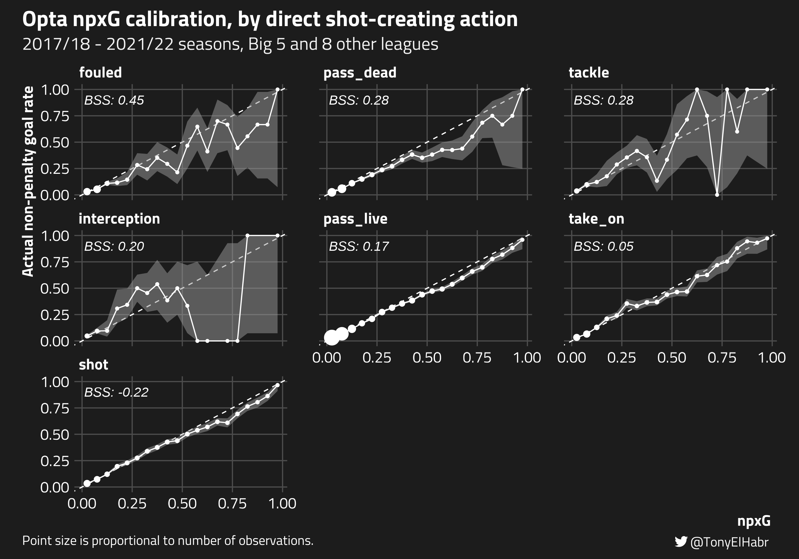
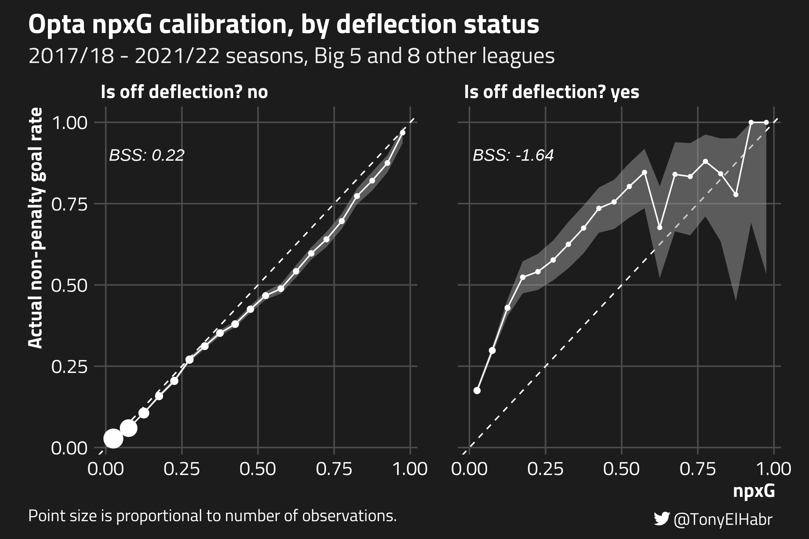
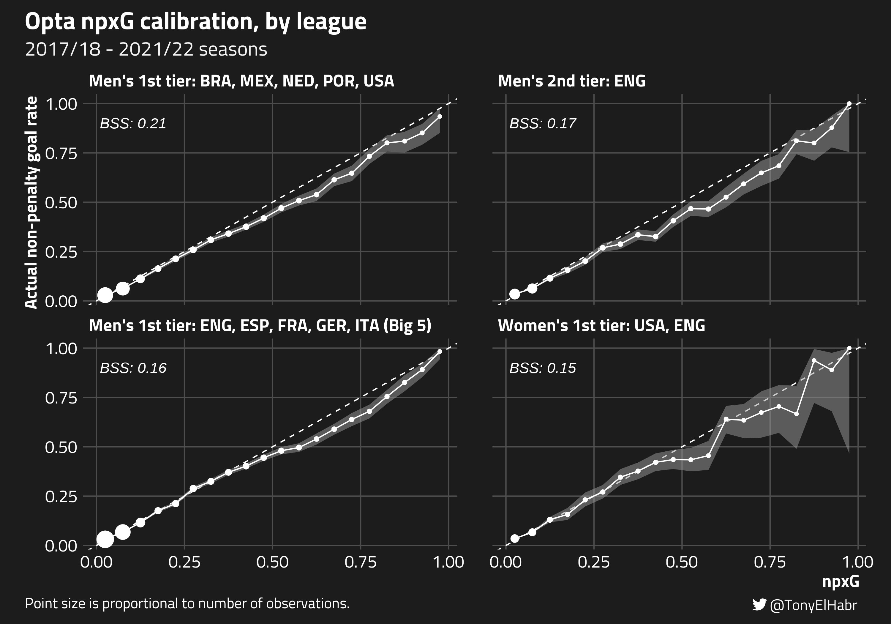

```{r}
#| label: setup
#| include: FALSE
#| echo: FALSE
knitr::opts_chunk$set(
  include = FALSE,
  echo = FALSE,
  cache = FALSE,
  eval = FALSE,
  cache.lazy = FALSE,
  fig.show = 'hide',
  fig.align = 'center',
  fig.width = 8,
  fig.asp = 0.75,
  fig.retina = 2,
  warning = FALSE,
  message = FALSE
)
```

## Introduction

Recently, [I pointed out](https://twitter.com/TonyElHabr/status/1614288983105617922) what seemed to be a bug with the [expected goals (xG)](https://theanalyst.com/na/2021/07/what-are-expected-goals-xg/) data shown on [FBref](https://fbref.com). In particular, the difference between non-penalty goals (npG) and non-penalty xG (npxG)[^1] seemed to be an outlier for the 2021/22 season across [the Big 5 leagues](https://fbref.com/en/comps/Big5/Big-5-European-Leagues-Stats).

[^1]: It's typically better to analyze expected goals after removing penalties since penalties can distort quantities, adding "noise" to an analysis.

<blockquote class="twitter-tweet">

<p lang="en" dir="ltr">

"aLl xG mOdeLs ArE thE sAme"<br><br>my brother in christ wut is this then <a href="https://t.co/7tjp1VFkoc">pic.twitter.com/7tjp1VFkoc</a>

</p>

--- Tony (@TonyElHabr) <a href="https://twitter.com/TonyElHabr/status/1614288983105617922?ref_src=twsrc%5Etfw">January 14, 2023</a>

</blockquote>

```{=html}
<script async src="https://platform.twitter.com/widgets.js" charset="utf-8"></script>
```
As it turns out FBref and their data provider, [Opta](https://www.statsperform.com/opta/), agreed! On Feb. 8, 2023, [they posted an update](https://twitter.com/fbref/status/1623358271791722502?s=20) indicating that they adjusted 2021/22 xG such that the difference between npG and npxG is much more in line with other seasons.

The FBref/Opta update gave me two ideas:

1.  **Compare pre- and post-update xG** to identify where/how adjustments were applied.[^2]

2.  **Quantify the [calibration](https://en.wikipedia.org/wiki/Calibration_(statistics)) of their xG model.**

[^2]: FBref/Opta didn't specify how they changed their xG model. Given how I observed very only trivial differences in the shot-level xG for prior seasons, it's possible that they didn't even change their model! There could have been some data issue specific to the 2021/22 season, that, when addressed, resulted in more plausible xG.

```{r}
#| label: data-pull
library(dplyr) ## 1.0.99.9000
library(purrr)
library(worldfootballR)
library(tidyr)

params <- bind_rows(
  'big5' = list(
    country = c('ENG', 'ESP', 'FRA', 'GER', 'ITA'),
    tier = '1st',
    gender = 'M'
  ),
  'other_1st_M' = list(
    country = c('POR', 'NED', 'BRA', 'MEX', 'USA'),
    tier = '1st',
    gender = 'M'
  ),
  '1st_F' = list(
    ## ESP only starts in season_end_year = 2023
    country = c('ENG', 'USA'),
    tier = '1st',
    gender = 'F'
  ),
  '2nd_M' = list(
    country = c('ENG'),
    tier = '2nd',
    gender = 'M'
  ),
  .id = 'group'
)

match_shooting <- params |> 
  group_by(group, tier, gender) |> 
  summarize(countries = list(country)) |> 
  ungroup() |> 
  mutate(
    data = pmap(
      list(
        countries,
        tier,
        gender,
        group
      ),
      ~{
        first_season_end_year <- ifelse(..4 == 'big5', 2018L, 2019L)
        res <- load_fb_match_shooting(
          country = ..1,
          tier = ..2,
          gender = ..3,
          season_end_year = first_season_end_year:2022L
        )
        res$Tier <- ..2
        res
      }
    )
  ) |> 
  select(group, data) |> 
  unnest(data)
```

```{r}
#| label: data-clean
library(lubridate)
library(stringr)

## https://github.com/tonyelhabr/sports_viz/blob/master/65-opta_xg_calib/1-pull-footedness.R
footedness <- read_csv(
  'https://raw.githubusercontent.com/tonyelhabr/sports_viz/master/65-opta_xg_calib/data/footedness.csv'
)
unambiguous_footedness <- footedness |> 
  semi_join(
    footedness |> 
      count(country, tier, gender, season_end_year, player, sort = TRUE) |> 
      filter(n == 1L),
    by = join_by(country, tier, gender, season_end_year, player)
  )

clean_match_shooting <- function(df) {
  df |> 
    transmute(
      match_url = MatchURL,
      group,
      country = Country,
      gender = Gender,
      tier = Tier,
      season_end_year = Season_End_Year,
      date = ymd(Date),
      half = Match_Half,
      minute = Minute,
      team = Squad,
      player = str_remove(Player, ' \\(.*$'),
      xg = as.numeric(xG),
      psxg = as.numeric(PSxG),
      outcome = Outcome,
      is_penalty = str_detect(Player, '\\(pen\\)'),
      is_goal = factor(ifelse(outcome == 'Goal', 'yes', 'no')),
      distance = as.integer(Distance),
      body_part = `Body Part`,
      notes = Notes,
      ## seems that they started to exclusively use Take-On instead of Dribble in 2022
      sca1 = ifelse(Event_SCA_1 == 'Dribble', 'Take-On', Event_SCA_1),
      sca2 = ifelse(Event_SCA_2 == 'Dribble', 'Take-On', Event_SCA_2)
    ) |> 
    left_join(
      unambiguous_footedness |> 
        select(
          country,
          tier,
          gender,
          season_end_year,
          player, 
          primary_foot = foot
        ),
      multiple = 'all',
      by = join_by(
        country, 
        tier, gender, 
        season_end_year, 
        player
      )
    ) |> 
    mutate(
      is_true_open_play = notes == '' & !is_penalty,
      is_from_deflection = str_detect(notes, 'Deflected'),
      is_from_volley = str_detect(notes, 'Volley'),
      is_free_kick = notes == 'Free kick',
      is_open_play = !is_free_kick & !is_penalty,
      is_primary_foot = case_when(
        is.na(body_part) ~ NA,
        is.na(primary_foot) ~ NA,
        !(body_part %in% sprintf('%s Foot', c('Left', 'Right'))) ~ NA,
        primary_foot == tolower(str_remove(body_part, ' Foot')) ~ TRUE,
        .default = FALSE
      )
    )
}

shots <- clean_match_shooting(match_shooting)

pull_old_fb_match_shooting <- function(country, gender, tier) {
  url <- sprintf(
    'https://github.com/JaseZiv/worldfootballR_data/releases/download/old_fb_match_shooting/%s_%s_%s_match_shooting.rds', 
    country,
    gender,
    tier
  )
  readRDS(url(url))
}

old_fb_match_shooting <- params |> 
  filter(group == 'big5') |> 
  mutate(
    data = pmap(
      list(
        country,
        gender,
        tier
      ),
      pull_old_fb_match_shooting
    )
  ) |> 
  unnest(data)

updated_shots <- inner_join(
  shots |> 
    filter(group == 'big5', season_end_year == 2022) |> 
    rename(new_xg = xg),
  old_fb_match_shooting |> 
    filter(Season_End_Year == 2022) |> 
    rename(
      Tier = tier
    ) |> 
    clean_match_shooting() |> 
    select(
      match_url, 
      half,
      minute,
      team,
      player,
      old_xg = xg
    ),
  by = join_by(match_url, half, minute, team, player),
  multiple = 'first'
) |> 
  relocate(old_xg, .before = new_xg)
```

## 1. Pre- and post-update xG comparison

```{r}
#| label: updated_np_shots
library(readr)

updated_np_shots <- read_rds('../sports_viz/65-opta_xg_calib/data/clean_updated_shots.rds') |> 
  filter(!is_penalty) |> 
  rename(league = country)

compare_by <- function(shots, ...) {
  shots |> 
    group_by(...) |> 
    summarize(
      n_shots = n(),
      n_same_npxg = sum(round(old_xg, 2) == round(new_xg, 2), na.rm = TRUE),
      n_old_npxg_is_higher = sum(round(old_xg, 2) > round(new_xg, 2), na.rm = TRUE),
      new_npxg = sum(new_xg, na.rm = TRUE),
      old_npxg = sum(old_xg, na.rm = TRUE)
    ) |> 
    ungroup() |> 
    transmute(
      ...,
      n_shots,
      n_same_npxg,
      n_diff_npxg = n_shots - n_same_npxg,
      n_old_npxg_is_higher,
      n_new_npxg_is_higher = n_diff_npxg - n_old_npxg_is_higher,
      prop_diff_npxg = n_diff_npxg / n_shots,
      prop_old_npxg_is_higher = n_old_npxg_is_higher / n_diff_npxg
    ) |> 
    arrange(desc(n_shots))
}

updated_np_shots |>
  compare_by() |> 
  glimpse()
#> Rows: 1
#> Columns: 7
#> $ n_shots                 <int> 44986
#> $ n_same_npxg             <int> 14750
#> $ n_diff_npxg             <int> 30236
#> $ n_old_npxg_is_higher    <int> 23584
#> $ n_new_npxg_is_higher    <int> 6652
#> $ prop_diff_npxg          <dbl> 0.6721202
#> $ prop_old_npxg_is_higher <dbl> 0.7799974
#> $ prop_old_npxg_is_higher  <dbl> 0.7799974
```

```{r}
#| label: discretized_updated_shots
library(forcats)

discretize_cols <- function(shots) {
  shots |> 
    select(
      league,
      date,
      half,
      minute,
      team,
      player,
      
      matches('^xg$|^(old|new)_xg$'),
      
      is_goal,
      distance,
      sca1,
      body_part,
      is_from_deflection,
      is_from_volley,
      is_free_kick,
      is_open_play,
      is_primary_foot
    ) |> 
    mutate(
      across(
        league,
        factor
      ),
      across(
        distance,
        ~cut(
          .x,
          breaks = c(seq(0, 18, by = 2), 20, 25, 30, 35, Inf)
        )
      ),
      across(sca1, ~na_if(.x, '')),
      across(
        sca1, 
        ~.x |> 
          str_remove_all( '\\(|\\)') |> 
          str_replace_all('\\s|[-]', '_') |> 
          tolower() |> 
          factor()
      ),
      across(
        c(
          is_from_deflection,
          is_from_volley,
          is_free_kick,
          is_open_play,
          is_primary_foot
        ),
        ~ifelse(.x, 'yes', 'no') |> 
          factor()
      ),
      across(
        c(
          is_primary_foot,
          body_part, 
          sca1,
          distance
        ), 
        ~fct_explicit_na(.x, na_level = 'missing')
      )
    )
}

discretized_updated_np_shots <- discretize_cols(updated_np_shots)
```

First, let's take a wholistic look at all of the shots for the 2021/22 seasons played in Big 5 leagues.[^3]

[^3]: All code available [on GitHub](https://github.com/tonyelhabr/itsmetoeknee).

```{r}
#| label: post-update-xgd
library(ggplot2)
library(sysfonts)
library(showtext)
library(ggtext)
library(ggforce)
library(ragg)

font <- 'Titillium Web'
sysfonts::font_add_google(font, font)
## https://github.com/tashapiro/tanya-data-viz/blob/main/chatgpt-lensa/chatgpt-lensa.R for twitter logo
sysfonts::font_add('fb', 'Font Awesome 6 Brands-Regular-400.otf')
showtext::showtext_auto()
showtext::showtext_opts(dpi = 300)

theme_set(theme_minimal())
theme_update(
  text = element_text(family = font),
  title = element_text(size = 20, color = 'white'),
  plot.title = element_text(face = 'bold', size = 20, color = 'white'),
  plot.title.position = 'plot',
  plot.subtitle = element_text(size = 16, color = '#f1f1f1'),
  axis.text = element_text(color = 'white', size = 14),
  axis.title = element_text(size = 14, color = 'white', face = 'bold', hjust = 0.99),
  axis.line = element_blank(),
  strip.text = element_text(size = 14, color = 'white', face = 'bold', hjust = 0),
  panel.grid.major = element_line(color = '#4d4d4d'),
  panel.grid.minor = element_line(color = '#4d4d4d'),
  panel.grid.minor.x = element_blank(),
  panel.grid.minor.y = element_blank(),
  plot.margin = margin(10, 20, 10, 20),
  plot.background = element_rect(fill = blackish_background, color = '#1c1c1c'),
  plot.caption = element_text(color = 'white', hjust = 0, size = 12, face = 'plain'),
  plot.caption.position = 'plot',
  plot.tag = ggtext::element_markdown(size = 12, color = 'white', hjust = 1),
  plot.tag.position = c(0.99, 0.01),
  panel.spacing.x = unit(2, 'lines'),
  panel.background = element_rect(fill = blackish_background, color = '#1c1c1c')
)
update_geom_defaults('text', list(color = 'white', size = 12 / .pt))

updated_xgd_n <- updated_shots |> 
  filter(!is_penalty) |> 
  count(old_xg, xgd = old_xg - new_xg) |>
  mutate(xgd_is_pos = xgd > 0) |> 
  arrange(old_xg, xgd)

tag_lab <- '<span style="font-family:fb";">&#xf099;</span> @TonyElHabr'
p_old_xg_vs_xgd <- updated_xgd_n |> 
  ggplot() +
  aes(x = old_xg, y = xgd) +
  geom_point(
    color = 'white',
    aes(
      size = n, 
      alpha = n
    )
  ) +
  scale_alpha_continuous(range = c(0.25, 1)) +
  guides(
    size = 'none',
    alpha = 'none'
  ) +
  coord_cartesian(
    xlim = c(0, 1),
    ylim = c(-1, 1),
    expand = TRUE
  ) +
  labs(
    title = 'Comparison of Opta non-penalty expected goals (npxG)',
    subtitle = 'Pre- and post-FBref update (2023-02-08) for Big 5 leagues, 2021/22 season',
    x = 'Pre-update npxG',
    y = 'Pre-update npxG minus post-update npxG',
    tag = tag_lab,
    caption = 'Each point represents a shot.\nLarger, more opaque points means there are more shots with a given x- and y-axis value.'
  ) +
  ggforce::geom_mark_hull(
    data = updated_xgd_n |> filter(xgd_is_pos),
    aes(
      label = 'Shots where pre-update\nnpxG was reduced'
    ),
    label.family = font,
    label.fontface = 'bold',
    label.hjust = 1,
    label.fontsize = 14,
    expand = unit(1, 'mm'),
    label.fill = NA_character_,
    # label.buffer = unit(5, 'mm'),
    con.border = 'none',
    con.linetype = 0,
    concavity = 10,
    ## assigning a variable with a hex code currently throws off Rmd formatting
    label.colour =  '#00b2a9',  
    con.colour =  '#00b2a9',
    colour =  '#00b2a9'
  )
p_old_xg_vs_xgd

plot_resolution <- 300
plot_dir <- '_posts/opta-xg-model-calibration'
ggsave(
  p_old_xg_vs_xgd,
  device = ragg::agg_png,
  res = plot_resolution,
  filename = file.path(plot_dir, 'old_xg_vs_xgd.png'),
  width = 8 * plot_resolution,
  height = 8 * plot_resolution,
  units = 'px'
)
```


Plotting the pre-update non-penalty shot-level xG data (x-axis) versus the difference in pre- and post-update xG (y-aixs), we see that the biggest reductions in xG occurred for shots where xG was relatively high (i.e. \>=0.25). While there were shots where xG increased post-update, the reductions pull down the overall average difference between the new and old xG data by \~0.01 per shot.

```{r}
#| label: discretized_updated_np_shots-glimpse
#| include: true
#| echo: true
glimpse(discretized_updated_np_shots)
#> Rows: 44,986
#> Columns: 16
#> $ league             <fct> ENG, ENG, ENG, ENG, ENG, ENG, ENG, ENG, ENG, ENG, E…
#> $ date               <date> 2021-08-13, 2021-08-13, 2021-08-13, 2021-08-13, 20…
#> $ half               <dbl> 1, 1, 1, 1, 1, 2, 2, 2, 1, 1, 1, 1, 1, 1, 1, 2, 2, …
#> $ minute             <chr> "11", "12", "22", "28", "30", "66", "73", "80", "2"…
#> $ team               <chr> "Brentford", "Brentford", "Brentford", "Brentford",…
#> $ player             <chr> "Frank Onyeka", "Bryan Mbeumo", "Sergi Canós", "Ser…
#> $ new_xg             <dbl> 0.08, 0.09, 0.02, 0.06, 0.26, 0.06, 0.40, 0.28, 0.0…
#> $ old_xg             <dbl> 0.09, 0.14, 0.04, 0.07, 0.31, 0.13, 0.58, 0.27, 0.0…
#> $ is_goal            <fct> no, no, yes, no, no, no, yes, no, no, no, no, no, n…
#> $ distance           <fct> "(8,10]", "(12,14]", "(16,18]", "(20,25]", "(12,14]…
#> $ sca1               <fct> pass_live, pass_live, pass_live, pass_live, take_on…
#> $ body_part          <fct> Head, Right Foot, Right Foot, Right Foot, Right Foo…
#> $ is_from_deflection <fct> no, no, no, no, no, no, no, no, no, no, no, no, no,…
#> $ is_from_volley     <fct> no, no, no, no, no, no, no, no, no, yes, no, no, no…
#> $ is_free_kick       <fct> no, no, no, no, no, no, no, no, no, no, no, no, no,…
#> $ is_primary_foot    <fct> missing, no, yes, yes, no, yes, missing, missing, y…

discretized_updated_np_shots |> 
  filter(!is_penalty) |> 
  mutate(xgd = old_xg - new_xg) |> 
  pull(xgd) |> 
  mean()
#> [1] 0.0095014
```

Of the 44,986 shots in the data set, 30,326 (67.2%) had changes to their xG values.[^4] Of those that changed, 23, 584 (78.0%) were reduced, i.e. the pre-update xG value was higher. We can look at changes to xG values grouped by various `feature`s that FBref publishes alongside each shot's xG, including `distance` (yards), `sca1` (direct [shot-creating action](https://www.sports-reference.com/blog/2020/04/goal-creation-possession-passing-and-more-advanced-stats-on-fbref/)), `body_part`, `is_from_deflection`, `is_from_volley`, `is_free_kick`, and `is_primary_foot`.[^5][^6]

[^4]: Observe that, for a large majority of shots, where xG is in the (0, 0.05] range, xG either did not change at all or only trivially changed. (See the blur of white points on the left-hand side of the plot.)

[^5]: Several of these are not provided directly from the raw FBref tables. For example, `is_from_deflection` is derived from the `Notes` field in the FBref shot table. `is_primary_foot` is derived from collecting player footedness data and checking for a match with `body_part`.

[^6]: Note that I use the term "feature" here, although this set of fields does not quite match the actual [inputs to the](https://theanalyst.com/eu/2021/07/what-are-expected-goals-xg) [Opta xG model](https://fbref.com/en/expected-goals-model-explained/). While things like `distance` and `body_part` certainly are inputs to the model, we don't have angle of the shot to the goal, and `is_primary_foot`---a field that I've added the feature set myself---isn't one of the model inputs, as far as I'm aware.

```{r}
#| label: updated_np_shot_diffs
library(scales)
library(knitr)
pivot_discretized_cols <- function(df) {
  df |> 
    select(-c(league, date, half, minute, team, player)) |> 
    pivot_longer(
      -c(is_goal, matches('xg$')),
      names_to = 'feature',
      values_to = 'group'
    )
}

updated_np_shot_diffs <- discretized_updated_np_shots |> 
  pivot_discretized_cols() |> 
  compare_by(feature, group)

slice_and_tabularize_np_shot_diffs <- function(op, n = 5) {
  updated_np_shot_diffs |> 
    filter(n_shots >= 100) |> 
    arrange(op(prop_old_npxg_is_higher)) |> 
    head(n) |> 
    transmute(
      Feature = sprintf('`%s`', feature),
      Group = sprintf('`%s`', ifelse(feature == "distance", as.character(group), paste0('"', group, '"'))),
      `# of non-penalty shots` = scales::comma(n_shots),
      `# of shots with changed npxG` = sprintf('%s (%.1f%%)', scales::comma(n_diff_npxg), 100 * prop_diff_npxg),
      `# of shots with lower post-update npxG of those that changed` = sprintf('%s (%.1f%%)', scales::comma(n_old_npxg_is_higher), 100 * prop_old_npxg_is_higher),
    ) |> 
    knitr::kable()
}

slice_and_tabularize_np_shot_diffs(`-`, n = 5)
slice_and_tabularize_np_shot_diffs(`+`, n = 6)
```

The table below shows that the reductions in npxG occurred most frequently for longer `distance`s (yards), suggesting that the pre-update xG model was over-predicting xG for longer shots. Interestingly, xG for shots when interceptions led directly to the shot (`sca1`), and xG for shots with `body_part = "other"` (non-foot, non-header) were also frequently reduced, in the cases where xG was changed.

| Feature     | Group            | \# of non-penalty shots | \# of shots with changed npxG | \# of shots with lower post-update npxG of those that changed |
|:------------|:-----------------|------------------------:|------------------------------:|--------------------------------------------------------------:|
| `distance`  | `(25,30]`        |                   6,061 |                 3,659 (60.4%) |                                                 3,437 (93.9%) |
| `distance`  | `(20,25]`        |                   6,760 |                 4,463 (66.0%) |                                                 4,088 (91.6%) |
| `sca1`      | `"interception"` |                     149 |                    96 (64.4%) |                                                    87 (90.6%) |
| `distance`  | `(18,20]`        |                   1,889 |                 1,232 (65.2%) |                                                 1,088 (88.3%) |
| `distance`  | `(30,35]`        |                   2,725 |                 1,267 (46.5%) |                                                 1,117 (88.2%) |
| `body_part` | `"Other"`        |                     191 |                   153 (80.1%) |                                                   130 (85.0%) |

On the other end of the spectrum, reductions in npxG occurred least frequently for shorter `distance` buckets (`(0,2]`, `(2,4]`, `(4,6]`, `(6,8)`). Reductions still occurred a majority of the time when there was a change---note that each has `>50%` for the last column---for all but the shortest `distance` group, `(0,2]`.

| Feature        | Group      | \# of non-penalty shots | \# of shots with changed npxG | \# of shots with lower post-update npxG of those that changed |
|:---------------|:-----------|------------------------:|------------------------------:|--------------------------------------------------------------:|
| `distance`     | `(0,2]`    |                     173 |                   130 (75.1%) |                                                    51 (39.2%) |
| `distance`     | `(2,4]`    |                   1,087 |                   826 (76.0%) |                                                   428 (51.8%) |
| `distance`     | `(4,6]`    |                   2,003 |                 1,479 (73.8%) |                                                   831 (56.2%) |
| `distance`     | `(35,Inf]` |                     539 |                   313 (58.1%) |                                                   177 (56.5%) |
| `distance`     | `(6,8]`    |                   2,557 |                 1,882 (73.6%) |                                                 1,183 (62.9%) |
| `is_free_kick` | `"yes"`    |                   1,576 |                   882 (56.0%) |                                                   557 (63.2%) |

## 2. xG Model Calibration

[I've touched on model calibration before](https://tonyelhabr.rbind.io/post/epl-xpts-simulation-1/#match-predictive-performance7), when discussing xG-implied match outcome probabilities. There, I wrote my own code to create a [calibration plot](https://changhsinlee.com/python-calibration-plot/). Since then, the [`{tidymodels}` team](https://www.tidymodels.org/) has added [calibration plot functionality](https://www.tidyverse.org/blog/2022/11/model-calibration/) to the [`{probably}` package](https://probably.tidymodels.org/). Let's try it out.

Here, we'll use a big sample of data---all 2017/18 - 2021/22 non-penalty shots for the Big 5 leagues and several other first and second tier leagues.[^7]

[^7]: Several leagues don't have data available for all such seasons, which is reflected in the row counts by group.

```{r}
#| label: np_shots
np_shots <- read_rds('../sports_viz/65-opta_xg_calib/data/clean_shots.rds') |> 
  filter(!is_penalty) |> 
  mutate(
    league = sprintf('%s_%s_%s', country, tier, gender)
  )

npxg_by <- function(shots, ...) {
  shots |> 
    group_by(...) |> 
    summarize(
      n_shots = n(),
      npxg = sum(xg, na.rm = TRUE),
      npg = sum(as.character(is_goal) == 'yes')
    ) |> 
    ungroup() |> 
    mutate(
      d = npxg - npg,
      d_rate = d / n_shots
    ) |> 
    arrange(desc(n_shots))
}

discretized_np_shots <- discretize_cols(np_shots)

np_shot_diffs <- discretized_np_shots |> 
  pivot_discretized_cols() |> 
  npxg_by(feature, group)

```

```{r}
#| label: np_shots-counts
#| eval: false
#| include: true
#| echo: true
np_shots |> count(league, name = 'n_shots')
#> # A tibble: 13 × 2
#>    league    n_shots
#>    <chr>       <int>
#>  1 BRA_1st_M   39380
#>  2 ENG_1st_F   11366
#>  3 ENG_1st_M   46766
#>  4 ENG_2nd_M   52701
#>  5 ESP_1st_M   43398
#>  6 FRA_1st_M   43021
#>  7 GER_1st_M   39148
#>  8 ITA_1st_M   49903
#>  9 MEX_1st_M   32650
#> 10 NED_1st_M   29803
#> 11 POR_1st_M   27366
#> 12 USA_1st_F    9887
#> 13 USA_1st_M   31047
```

### Calibration plot

We can use `probably::cal_plot_breaks()` to visually assess whether the observed rate of non-penalty goals (y-axis) is close to the predicted probably of goals (npxG, x-axis).[^8] If the xG model's predictions are "well calibrated", the calibration points will align with the "ideal" line having slope 1 and intercept 0. Points at which the curve is below the diagonal line indicate where the model is more likelty to overpredict; and, likewise, points where the curve is above the diagonal line indicate where the model is underpredicting.

[^8]: I've written my own code to plot the calibration, but I imagine most users will be satisfied with the plot that `{probably}` will generate for you.

```{r}
#| label: overall_calibration
#| eval: false
#| echo: true
#| include: true
library(probably) ## 0.1.0.9007

overall_calibration <- cal_plot_breaks(
  np_shots,
  truth = is_goal,
  estimate = xg,
  num_breaks = 20,
  conf_level = 0.9,
  event_level = 'second'
)
```

```{r}
#| label: p_overall_calibration
overall_calibration$data |> 
  group_by(group = predicted_midpoint <= 0.25) |> 
  summarize(across(total, sum)) |> 
  ungroup() |> 
  mutate(prop = total / sum(total))

plot_and_save_calibration <- function(
    df,
    size = 7,
    width = size, 
    height = 7, 
    title = NULL,
    subtitle = 'Big 5 and 8 other leagues',
    caption = NULL,
    filename = tempfile(),
    labels_layer
) {
  
  group_cols <- setdiff(
    colnames(df),
    c('predicted_midpoint', 'event_rate', 'events', 'total', 'lower', 'upper')
  )
  
  has_group_cols <- length(group_cols) > 0
  
  p <- df |> 
    ggplot() +
    aes(x = predicted_midpoint, y = event_rate) +
    geom_abline(color = 'white', linetype = 2) +
    geom_ribbon(
      fill = '#999999',
      alpha = 0.5,
      aes(ymin = lower, ymax = upper)
    ) +
    geom_line(color = 'white') +
    geom_point(
      color = 'white',
      aes(size = total),
      show.legend = FALSE
    ) +
    labs(
      title = paste0(c('Opta npxG calibration', title), collapse = ', by '),
      subtitle = paste0(c('2017/18 - 2021/22 seasons', subtitle), collapse = ', '),
      y = 'Actual non-penalty goal rate',
      x = 'npxG',
      caption = paste0(c('Point size is proportional to number of observations.', caption), collapse = '\n'),
      tag = tag_lab
    )
  
  if (isTRUE(has_group_cols)) {
    p <- p + facet_wrap(vars(!!!rlang::syms(group_cols)))
  }
  
  if (!missing(labels_layer)) {
    p <- p + labels_layer
  }
  
  ggsave(
    p,
    device = ragg::agg_png,
    res = plot_resolution,
    filename = file.path(plot_dir, sprintf('%s_calibration.png', filename)),
    width = width * plot_resolution,
    height = height * plot_resolution,
    units = 'px'
  )
  invisible(p)
}

overall_calibration$data |> 
  plot_and_save_calibration(
    width = 7,
    height = 7 / 1.5,
    filename = 'overall'
  )
```


We can see that the model is pretty well calibrated on the lower end of the spectrum, when xG \< 0.25. This makes up a larger majority of the shots (\~90%). However, the model is not as well calibrated for higher xG values, tending to overpredict. For example, at the calibration point where npxG is `0.675`, the actual goal rate is `0.6`.

### Brier Skill Score (BSS)

One thing that is not provided in the `{tidymodels}` realm (specifically, the `{yardstick}` package) is a function to compute [Brier score](https://en.wikipedia.org/wiki/Brier_score). Nonetheless, we can define a Brier score function ourselves by closely following [the mean squared error custom metric example](https://www.tidymodels.org/learn/develop/metrics/) provided by the `{tidymodels}` team.[^9]

[^9]: Brier score for a binary classification task is equivalent to mean squared error.

```{r}
#| label: bss
#| eval: false
#| include: true
#| echo: true
library(yardstick)
brier_score <- function(data, ...) {
  UseMethod('brier_score')
}

brier_score <- yardstick::new_prob_metric(brier_score, direction = 'minimize')

brier_score_vec <- function(truth, estimate, na_rm = TRUE, event_level, ...) {
  
  brier_score_impl <- function(truth, estimate, event_level, ...) {
    truth <- 1 - (as.numeric(truth) - 1)
    
    if (event_level == 'second') {
      truth <- 1 - truth
    }
    
    mean((truth - estimate)^2)
  }
  
  ## Recycle the estimate value if it's scalar-ish.
  if (length(estimate) == 1) {
    estimate <- rep(estimate, length(truth))
  }
  
  yardstick::metric_vec_template(
    metric_impl = brier_score_impl,
    truth = truth,
    estimate = estimate,
    na_rm = na_rm,
    cls = c('factor', 'numeric'),
    estimator = 'binary',
    event_level = event_level,
    ...
  )
}

brier_score.data.frame <- function(data, truth, estimate, na_rm = TRUE, event_level = 'first', ...) {
  yardstick::metric_summarizer(
    metric_nm = 'brier_score',
    metric_fn = brier_score_vec,
    data = data,
    truth = !!rlang::enquo(truth),
    estimate = !!rlang::enquo(estimate),
    na_rm = na_rm,
    event_level = event_level,
    ...
  )
}
```

Let's compute the Brier scores for (1) the overall goal rate (i.e. shots per goal) and (2) xG. We should expect the Brier score for the latter to be closer to 0 (perfect model), since xG should be a better predictor of goals than the naive goal rate.

```{r}
#| label: np_goal_rate_brier_score
#| eval: false
#| include: true
#| echo: true
np_goal_rate <- np_shots |> 
  count(is_goal) |> 
  mutate(prop = n / sum(n)) |> 
  filter(is_goal == 'yes') |> 
  pull(prop)
np_goal_rate
#> 0.0960288

np_goal_rate_brier_score <- np_shots |> 
  brier_score(
    truth = is_goal,
    estimate = !!np_goal_rate,
    event_level = 'second'
  ) |> 
  pull(.estimate)
np_goal_rate_brier_score
#> [1] 0.08680727

npxg_brier_score <- np_shots |> 
  brier_score(
    truth = is_goal,
    estimate = xg,
    event_level = 'second'
  ) |> 
  pull(.estimate)
npxg_brier_score
#> [1] 0.07150071
```

Now we can go on to compute [Brier skill score (BSS)](https://en.wikipedia.org/wiki/Brier_score#Brier_Skill_Score_(BSS)) using an appropriate reference Brier score.[^10] In this context, the average goal rate seems to be a good choice for a baseline. In contrast to the Brier score, a higher BSS is ideal. (A perfect model would have a BSS of 1.)

[^10]: Personally, I like to use BSS over other classification metrics like [ROC AUC](https://en.wikipedia.org/wiki/Receiver_operating_characteristic) or Brier score alone. BSS is arguably the most interpretable probabilistic classification measure. Also, I like that it forces one to choose a reference with which to compare, which is a good principle in general, I think.

```{r}
#| label: npxg_brier_score
#| eval: false
#| include: true
#| echo: true
npxg_brier_score <- np_shots |> 
  brier_score(
    truth = is_goal,
    estimate = xg,
    event_level = 'second'
  ) |> 
  pull(.estimate)
1 - (npxg_brier_score / np_goal_rate_brier_score)
#> [1] 0.176328
```

A BSS of \~0.18 is not bad! This is better than [FiveThirtyEight's BSS](https://projects.fivethirtyeight.com/checking-our-work/) for predicting the results for men's World Cup matches (\~0.12 at time of writing) and right around their BSS for predicting WNBA playoff game outcomes (\~0.18).

### Grouped Calibration and BSS

Now let's take a look at model calibration under specific criteria. Is the model worse for shots that follow a dribble (`take_on`) shot-creating action? After a `live_ball` pass? etc.

```{r}
#| label: sca1-calibration
generate_bss_labels_layer <- function(df) {
  geom_text(
    inherit.aes = FALSE,
    data = df,
    color = 'white',
    fontface = 'italic',
    size = 12 / .pt,
    hjust = 0,
    vjust = 0.5,
    aes(
      x = 0.01,
      y = 0.9,
      label = label
    )
  )
}

calculate_then_plot_and_save_calibration <- function(df, group, ...) {
  
  group <- rlang::enquo(group) 
  bss <- df |> 
    group_by(!!group) |> 
    brier_score(
      truth = is_goal,
      estimate = xg,
      event_level = 'second'
    ) |> 
    ungroup() |> 
    transmute(
      !!group, 
      label = sprintf('BSS: %.2f', 1 - (.estimate / !!np_goal_rate_brier_score))
    )
  
  labels_layer <- generate_bss_labels_layer(bss)
  
  df |> 
    cal_plot_breaks(
      group = !!group,
      truth = is_goal,
      estimate = xg,
      num_breaks = 20,
      conf_level = 0.9,
      event_level = 'second'
    ) |> 
    pluck('data') |> 
    plot_and_save_calibration(
      ...,
      labels_layer = labels_layer
    )
}

discretized_np_shots |> 
  calculate_then_plot_and_save_calibration(
    group = sca1,
    title = 'direct shot-creating action',
    size = 10,
    filename = 'sca1'
  )
```



```{r}
#| label: sca1-calibration-notes
discretized_np_shots |> 
  filter(sca1 == 'fouled') |> 
  count(g = as.integer(is_goal) - 1) |> 
  mutate(prop = n / sum(n))

discretized_np_shots |> 
  filter(sca1 == 'pass_live') |> 
  count(g = as.integer(is_goal) - 1) |> 
  mutate(prop = n / sum(n))
```

A couple of observations and thoughts:

-   xG of shots following another shot are over-predicted so much that it causes the BSS to be negative. This means that the model is actually doing worse in its xG assignment than simply predicting naive goal rate for shots after another shot!

-   A relatively "jagged" calibration plot may not correspond with a worse (lower) BSS score; and visa versa, a relatively "smooth" calibration plot may not correspond with a better (higher) BSS.

    -   Note that the `fouled` calibration looks jagged for higher predicted xG, but the fact goals are only scored on about 5% shots immediately following a foul means that inprecise probabilities are not "penalized" quite as much. On the other hand, while the `pass_live` calibration looks relatively smooth, the fact that 10% of shots following live ball passes (2x the frequency for shots following fouls) means that it is more penalized for imprecision than an otherwise equivalent post-`fouled` shot. In fact, this is [one of the shortcomings of BSS](https://en.wikipedia.org/wiki/Brier_score#Shortcomings)---it does not do a great job with evaluation of relatively infrequent events, such as goals.

Next, let's take a look at calibration off shots coming from deflections (of other shots).

```{r}
#| label: deflection-calibration
discretized_np_shots |> 
  mutate(
    across(
      is_from_deflection,
      ~factor(sprintf('Is off deflection? %s', as.character(.x)))
    )
  ) |> 
  calculate_then_plot_and_save_calibration(
    group = is_from_deflection,
    title = 'deflection status',
    width = 8,
    height = 8 / 1.5,
    filename = 'deflection'
  )
```



-   The model doesn't seem to be very well calibrated for shots following deflections! Like shots following other shots in the shot-creating action calibration plot, the BSS for shots after deflections is negative. And, perhaps more interestingly, the model seems to underpredict post-deflection shots, which is the opposite of it's general tendency to overpredict. (See the wholistic calibration plot from before.)
    -   I'd suspect that there's lots of confounders that might explain the lack of calibration after deflections. For one, it could be the case that there are often zero defenders between the shot-taker and keeper for shots following a deflection. As far as I know, the Opta model doesn't have an explicit feature for this (although perhaps they have a confidential one that does).
    -   It might also be the case that Opta's ["big chance" indicator](https://theanalyst.com/eu/2021/07/what-are-expected-goals-xg)---which is not published on FBref but which I suspect take on a value of "yes"/1/true for many post-deflection shots---may have some flaws.

Moving on, let's look at calibration of the xG model by groups of leagues, splitting out by tier and gender.

```{r}
#| label: league_group-calibration
discretized_np_shots |> 
  mutate(
    league_group = case_when(
      league %in% sprintf('%s_1st_M', c('ENG', 'ESP', 'FRA', 'GER', 'ITA')) ~ 'Big 5',
      league %in% sprintf('%s_1st_F', c('ENG', 'USA')) ~ "Women's 1st tier: USA, ENG",
      league == 'ENG_2nd_M' ~ "Men's 2nd tier: ENG",
      TRUE ~ "Men's 1st tier: POR, NED, BRA, MEX, USA"
    ) 
  ) |> 
  calculate_then_plot_and_save_calibration(
    group = league_group,
    title = 'league',
    subtitle = NULL,
    size = 10,
    filename = 'league_group'
  )
```



-   [StatsBomb has talked](https://statsbomb.com/articles/soccer/analytics-and-modelling-in-womens-football/) about how a "gender-aware" model outperformed a baseline model, so one might expect the calibration of Opta's singular model to be weaker for the women's game. It turns out that, yes, the calibration seems to be a bit worse for shots in the women's leagues, although maybe not as bad as one might have guessed.
-   Interestingly, the calibration of the model for non-Big 5 leagues and the English men's Championship league are slightly better according to BSS, although I'd suspect that the differences are not actually statistically significant.

Finally, let's look at how footedness may play a role in model calibration. As far as I know, whether or not a footed shot is take by a player's primary foot is not an input into the Opta model, so it may be particularly interesting to look at.

```{r}
#| label: footedness-calibration
discretized_np_shots |> 
  filter(
    !(body_part %in% c('Right Foot', 'Left Foot') & is_primary_foot == 'missing')
  ) |> 
  mutate(
    footedness = case_when(
      body_part == 'Head' ~ 'head',
      body_part == 'Other' ~ 'other',
      body_part == 'Left Foot' & is_primary_foot == 'yes' ~ 'left foot shot, left-footed',
      body_part == 'Left Foot' & is_primary_foot == 'no' ~ 'left foot shot, right-footed',
      body_part == 'Right Foot' & is_primary_foot == 'yes' ~ 'right foot shot, right-footed',
      body_part == 'Right Foot' & is_primary_foot == 'no' ~ 'right foot shot, left-footed'
    ) |> 
      factor(
        levels = c(
          'head',
          'other',
          sprintf('left foot shot, %s-footed', c('left', 'right')),
          sprintf('right foot shot, %s-footed', c('right', 'left'))
        )
      )
  ) |> 
  calculate_then_plot_and_save_calibration(
    group = footedness,
    title = 'body part and footedness',
    caption = 'Shots taken by both-footed players or missing footedness data not shown.',
    size = 10,
    filename = 'footedness'
  )
```


-   Comparing the dominant-footed facets (`right foot shot, right-footed` and `left foot shot, left-footed`) to their weak-footed counterparts (`right foot shot, left-footed` and `left foot shot, right-footed`), the xG for shots take by a player's weak foot have lower BSS! I had suspected that the model might not perform as well for such shots.
    -   On the other hand, the model seems to be **overpredict**ing xG for weak-footed shots more so that it overpredicts xG for dominant-footed shots. (I would have guessed that it would underpredict xG for such shots.) Without looking more into this, I'd suspect this is due to selection bias---players are more likely to take weak-footed shots when they're closer to the goal, where shots are likely to have higher xG, shots are more likely to be goals, and there is more of a possibility that the model is confidently wrong.
-   Of the non-footed shots, it's interesting to see that the BSS for headers and shots from `other` body parts are not particularly well calibrated. In fact, the latter has a negative BSS, indicating that we'd better off with a model that predicted the average goal rate for such shots.

## Conclusion

We've explored the wonderful world of model calibration, making friends with BSS and calibration curves in our investigation of a public xG model. Are BSS and calibration curves the be-all and end-all when it comes to model evaluation? Of course not! But they're useful tools that may or may not be appropriate for your use case.

When it comes to the Opta xG model specifically, am I implying that the model is bad? Of course not! Yes, faceted calibration curves and feature-specific BSS can make a model look bad, but we must keep in mind that there are trade-offs to be made with modeling. Fine-tuning a model to be more well calibrated under certain conditions, e.g. shots after deflections, may make other parts of the model worse! It's all about trade-offs.
