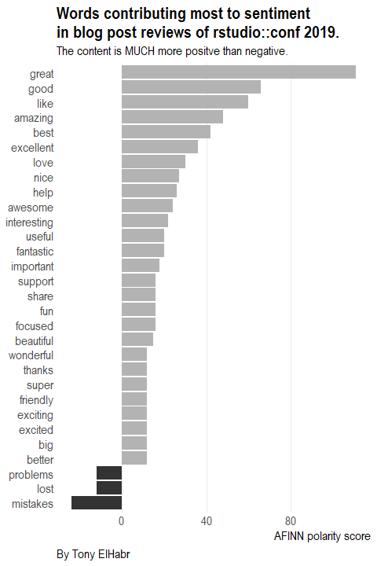

```{r setup, include=F, echo=F, cache=F}
knitr::opts_chunk$set(
  include = TRUE,
  echo = TRUE,
  cache = FALSE,
  eval = FALSE,
  cache.lazy = FALSE,
  fig.show = 'hide',
  fig.align = 'center',
  fig.width = 8,
  fig.asp = 0.75,
  fig.retina = 2,
  warning = FALSE,
  message = FALSE
)
```

To be honest, I planned on writing a review of this past weekend's [rstudio::conf 2019](https://resources.rstudio.com/rstudio-conf-2019), but several other people have already done a great job of doing that---just check out [Karl Broman's aggregation of reviews at the bottom of the page here](https://github.com/kbroman/RStudioConf2019Slides)! (More on this in a second.) In short, my thoughts on the whole experience are captured perfectly by [Nick Strayer](http://nickstrayer.me/)'s tweet the day after the conference ended.


Anyways, I figured that this was the perfect opportunity to do some text analysis. Why not extract the text from the reviews of others---linked in Karl's repo---and make my own summary of the event? Plotting word frequencies and sentiments, while not exactly "cutting edge" compared to robust [natural language processing](https://en.wikipedia.org/wiki/Natural_language_processing) techniques, is perfect for getting a nice, simple overview of the conference. (I have applied some of the techniques described by [David Robinson](http://varianceexplained.org/) and [Julia Silge](https://juliasilge.com/blog) in their [*Tidy Text Mining with R* book](https://www.tidytextmining.com/)

Moreover, after reading [Bob Rudis's recent post](https://rud.is/b/2019/01/21/hrbrthemes-0-6-0-on-cran-other-in-development-package-news/) and discovering his work-in-progress " `{curl}` +`{httr}` + `{rvest}`" package called [`{reapr}`](https://git.sr.ht/~hrbrmstr/reapr), I realized that the work of cleaning the HTML and text for each person's blog post would not be so bad. In fact, it turned out to be as easy as `reapr::reap_url() %>% reapr::mill()` (with only a little bit of extra work :smile:).

After trying a couple of different approaches (e.g. bigrams, topic modeling, etc.) and experimenting with some different visualizations, I ended up making the two plots below. (To the interested reader, I've included all of the code at the bottom of this post.) From the second plot---where positive sentiment heavily outweighs negative sentiment---one thing is clear: the `R` community is **super supportive and positive**, just as Nick alluded to in his tweet.



