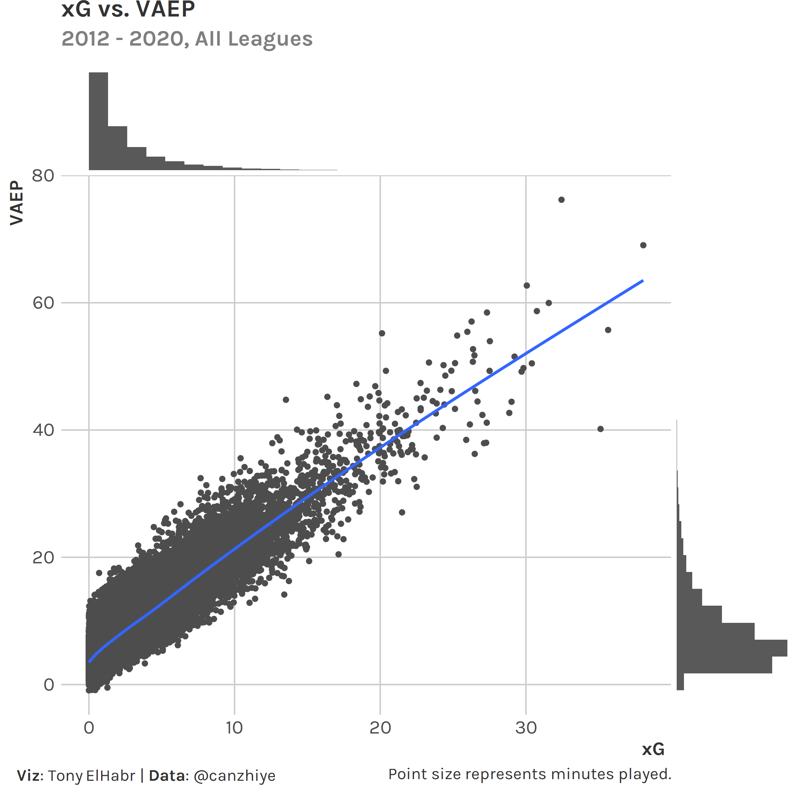
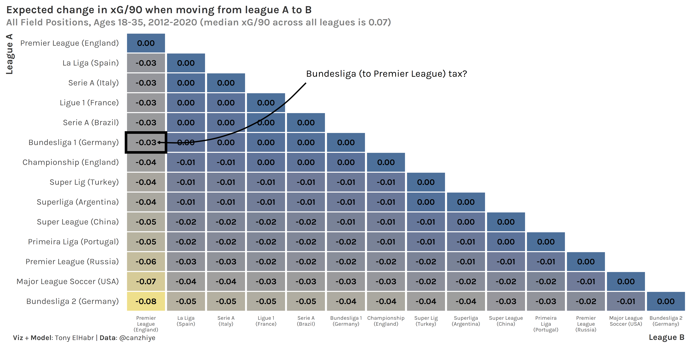
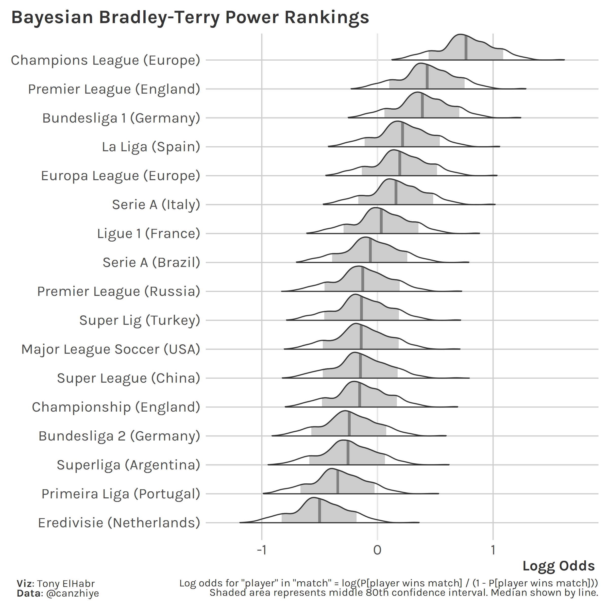
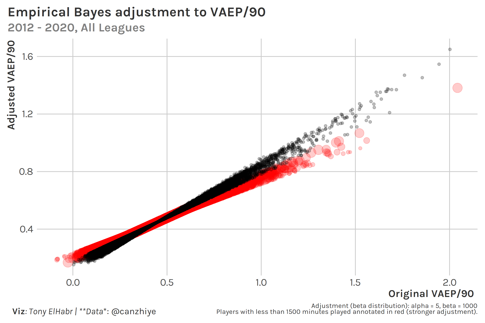

## Introduction

Arguing about domestic league strength is something that soccer fans seems to never tire of. ([*"Could Messi do it on a cold rainy night in Stoke?"*](https://www.goal.com/en-us/news/what-does-can-they-do-it-on-a-cold-rainy-night-in-stoke-mean/1f7alegnrwfr01i5vj34vak59k)) Many of these conversations are anecdotal, leading to "hot takes" that are unfalsifiable. While we'll probably never move away from these kinds of discussions, we can at least try to inform them with a quantitative approach.

Perhaps the obvious way to do so is to take match results from international tournaments (e.g. Champions League, Europa). But such an approach can be flawed---there's not a large sample, and match results may not be reflective of "true" team strength (e.g. one team may win on xG by a large margin, but lose the game.)

## Methodology

But what if we used an approach rooted in player performance? [I asked myself](https://twitter.com/TonyElHabr/status/1405946557237796871) that very question and came up with the following approach. (Thanks to [Cahnzhi Ye](https://twitter.com/canzhiye) for the data.)

1.  Identify players who played in more than one league within the same season or across consecutive seasons. Calculate the difference in each player's [atomic VAEP](https://arxiv.org/pdf/1802.07127.pdf)[^1] per 90 minutes (VAEP/90) after changing leagues.

[^1]: Valuing Actions by Estimating Probabilities (VAEP) based on the atomic SPADL format.


```r
# # A tibble: 2,462 x 7
#    Season Player        `League A`        `League B`       `VAEP/90 A` `VAEP/90 B`   Diff.
#     <dbl> <chr>         <chr>             <chr>                  <dbl>       <dbl>   <dbl>
#  1   2020 Timo Werner   Bundesliga 1 (Ge~ Premier League ~       1.25        0.638  0.610 
#  2   2020 Alexander Sø~ Super Lig (Turke~ Bundesliga 1 (G~       1.07        0.773  0.296 
#  3   2020 Hakim Ziyech  Eredivisie (Neth~ Premier League ~       0.958       0.365  0.593 
#  4   2020 Nicolás Gonz~ Bundesliga 2 (Ge~ Bundesliga 1 (G~       0.917       0.943 -0.0256
#  5   2020 Fabian Klos   Bundesliga 2 (Ge~ Bundesliga 1 (G~       0.904       0.547  0.358 
#  6   2020 Victor Osimh~ Ligue 1 (France)  Serie A (Italy)        0.889       1.01  -0.120 
#  7   2020 Eldor Shomur~ Premier League (~ Serie A (Italy)        0.882       0.755  0.126 
#  8   2020 Callum Robin~ Championship (En~ Premier League ~       0.880       0.682  0.198 
#  9   2020 Jarrod Bowen  Championship (En~ Premier League ~       0.871       0.448  0.423 
# 10   2020 Aleksandar M~ Championship (En~ Premier League ~       0.866       0.499  0.367 
# # ... with 2,452 more rows
```

Why VAEP? Theoretically it should capture more about in-game actions (including defense) than other stats such as [xG](https://fbref.com/en/expected-goals-model-explained/), which is biased in favor of attacking players. VAEP is not perfect by any means (e.g. it does not capture off-ball actions), but, in theory, it should be a better measure of overall performance. [^2]

[^2]:  [I had a Twitter thread in May 2021 describing how one could use VAEP ratings.](https://twitter.com/TonyElHabr/status/1393553732659519490)

Notably, we give up a little in interpretability in using VAEP, since it's not directly translatable to goals. [^3] The following table of top season-long xG totals since 2012 to contextualize the magnitudes of xG and VAEP.

[^3]: It's closer to [xG+xA](https://www.optasports.com/services/analytics/advanced-metrics/), although the authors might disagree with that as well. It's really best treated separately, which perhaps explains why the authors often using "rating" and "contribution" when referring to VAEP.


```r
# # A tibble: 36,857 x 5
#    Season Player             Minutes    xG  VAEP
#     <dbl> <chr>                <dbl> <dbl> <dbl>
#  1   2015 Lionel Messi          3529  38.1  69.0
#  2   2016 Luis Suárez           3294  35.6  55.7
#  3   2018 Robert Lewandowski    2259  35.1  40.2
#  4   2012 Lionel Messi          3425  32.4  76.2
#  5   2013 Lionel Messi          2776  31.6  60.0
#  6   2015 Cristiano Ronaldo     3236  30.8  58.7
#  7   2018 Mohamed Salah         3080  30.4  50.5
#  8   2012 Cristiano Ronaldo     3504  30.1  62.7
#  9   2017 Edin Dzeko            3216  29.8  49.7
# 10   2020 Robert Lewandowski    2902  29.7  49.2
# # ... with 36,847 more rows
```

And a scatter plot, because who doesn't love a graph.



2.  Convert the player-level VAEP/90 differences to z-scores by position and age group.


```r
# # A tibble: 2,462 x 7
#    Season Player      Position `Age Group` `League A`      `League B`    `VAEP/90 Diff. Z`
#     <dbl> <chr>       <chr>    <chr>       <chr>           <chr>                     <dbl>
#  1   2020 Timo Werner AM       24<=x<27    Bundesliga 1 (~ Premier Leagu~            2.28 
#  2   2020 Alexander ~ FW       24<=x<27    Super Lig (Tur~ Bundesliga 1 ~            1.10 
#  3   2020 Hakim Ziye~ M        27<=x<30    Eredivisie (Ne~ Premier Leagu~            3.20 
#  4   2020 Nicolás Go~ M        18<=x<24    Bundesliga 2 (~ Bundesliga 1 ~           -0.148
#  5   2020 Fabian Klos FW       30<=x<36    Bundesliga 2 (~ Bundesliga 1 ~            1.20 
#  6   2020 Victor Osi~ FW       18<=x<24    Ligue 1 (Franc~ Serie A (Ital~           -0.439
#  7   2020 Eldor Shom~ FW       24<=x<27    Premier League~ Serie A (Ital~            0.471
#  8   2020 Callum Rob~ AM       24<=x<27    Championship (~ Premier Leagu~            0.740
#  9   2020 Jarrod Bow~ AM       18<=x<24    Championship (~ Premier Leagu~            1.89 
# 10   2020 Aleksandar~ FW       24<=x<27    Championship (~ Premier Leagu~            1.37 
# # ... with 2,452 more rows
```

Why grouping? This is intended to account for the fact that attacking players and "peaking" players (usually age 24-30) tend to have higher VAEP/90, so their league-to-league differences have larger variation. The choice to normalize is perhaps more questionable. The mean of differences is \~0 for all groups already, but the dispersion is smaller without normalization (i.e. standard deviations are closer to 0). So, in this case, normalization should help the linear model capture variation.


```r
# # A tibble: 20 x 5
#    Position Age Group N    Mean   SD
#    <chr>    <chr>    <int> <dbl>  <dbl>
#  1 AM       18<=x<24   138     0 0.224 
#  2 AM       24<=x<27   128     0 0.268 
#  3 AM       27<=x<30   118     0 0.248 
#  4 AM       30<=x<36    68     0 0.248 
#  5 D        18<=x<24   203     0 0.112 
#  6 D        24<=x<27   268     0 0.101 
#  7 D        27<=x<30   295     0 0.0930
#  8 D        30<=x<36   316     0 0.0939
#  9 DM       18<=x<24    30     0 0.102 
# 10 DM       24<=x<27    48     0 0.0913
# 11 DM       27<=x<30    20     0 0.105 
# 12 DM       30<=x<36    13     0 0.0719
# 13 FW       18<=x<24    26     0 0.274 
# 14 FW       24<=x<27    67     0 0.268 
# 15 FW       27<=x<30    50     0 0.263 
# 16 FW       30<=x<36    66     0 0.297 
# 17 M        18<=x<24   113     0 0.173 
# 18 M        24<=x<27   130     0 0.147 
# 19 M        27<=x<30   189     0 0.185 
# 20 M        30<=x<36   186     0 0.171  
```

3.  Run a single regression where the response variable is the z-transformed VAEP/90 difference, and the features are indicators for leagues leagues, where -1 indicates player departure, a +1 indicates player arrival, and all other values are 0.[^4] [^5]

[^4]: Each row represents one player. Each row only has one +1 and one -1, and 0s for other features.

[^5]: We're including all positions and ages in this regression, even though these groupings have varying standard deviations for transformation of the response variable. (All have 0 mean, as one might expect with a feature representing the difference between values with the same distribution.)

For those familiar with basketball and hockey, this is similar to the set-up for [an adjusted plus-minus (APM) calculation](https://squared2020.com/2017/09/18/deep-dive-on-regularized-adjusted-plus-minus-i-introductory-example/). Here, each feature column is a league (instead of a player), each row represents a player (instead of a "stint"), and the response is transformed VAEP/90 (instead of net points per possession).


```r
# tibble [2,472 x 16] (S3: tbl_df/tbl/data.frame)
#  $ VAEP/90 Diff Z-Trans     : num [1:2472] -0.0825 0.3285 -0.0143 0.1137 0.1526 ...
#  $ Serie A (Italy)          : int [1:2472] -1 -1 -1 -1 -1 -1 -1 -1 -1 -1 ...
#  $ Bundesliga 1 (Germany)   : int [1:2472] 1 1 0 0 0 0 0 0 0 0 ...
#  $ La Liga (Spain)          : int [1:2472] 0 0 0 0 0 0 0 0 0 0 ...
#  $ Serie A (Brazil)         : int [1:2472] 0 0 0 0 0 1 0 0 0 0 ...
#  $ Super Lig (Turkey)       : int [1:2472] 0 0 1 0 0 0 0 1 0 0 ...
#  $ Premier League (England) : int [1:2472] 0 0 0 0 0 0 0 0 0 0 ...
#  $ Super League (China)     : int [1:2472] 0 0 0 0 0 0 0 0 0 1 ...
#  $ Major League Soccer (USA): int [1:2472] 0 0 0 0 1 0 1 0 0 0 ...
#  $ Primeira Liga (Portugal) : int [1:2472] 0 0 0 0 0 0 0 0 0 0 ...
#  $ Ligue 1 (France)         : int [1:2472] 0 0 0 1 0 0 0 0 0 0 ...
#  $ Bundesliga 2 (Germany)   : int [1:2472] 0 0 0 0 0 0 0 0 0 0 ...
#  $ Championship (England)   : int [1:2472] 0 0 0 0 0 0 0 0 0 0 ...
#  $ Premier League (Russia)  : int [1:2472] 0 0 0 0 0 0 0 0 0 0 ...
#  $ Superliga (Argentina)    : int [1:2472] 0 0 0 0 0 0 0 0 1 0 ...
#  $ Eredivisie (Netherlands) : int [1:2472] 0 0 0 0 0 0 0 0 0 0 ...
```

The result is a set of coefficient estimates corresponding to each league. Notably, these are all positive (even if subtracting the intercept), and the Netherlands coefficient is `NA` due to multi-collinearity in the data. [^6]

[^6]: This `NA` occurs even when setting the intercept to 0, which is typically the way to get around this kind of issue with `lm` in R. When changing the order of columns in the regression and forcing the Netherlands coefficient to be non-`NA`, it's estimate is lower than that of Bundesliga 2 (and a different league's estimate is `NA`).


```r
# # A tibble: 16 x 2
#    League                    Estimate
#    <chr>                        <dbl>
#  1 Premier League (England)    0.975 
#  2 La Liga (Spain)             0.869 
#  3 Ligue 1 (France)            0.786 
#  4 Serie A (Italy)             0.738 
#  5 Serie A (Brazil)            0.724 
#  6 Primeira Liga (Portugal)    0.675 
#  7 Bundesliga 1 (Germany)      0.649 
#  8 Championship (England)      0.641 
#  9 Super Lig (Turkey)          0.617 
# 10 Premier League (Russia)     0.485 
# 11 Superliga (Argentina)       0.463 
# 12 Super League (China)        0.360 
# 13 Major League Soccer (USA)   0.281 
# 14 Bundesliga 2 (Germany)      0.197 
# 15 (Intercept)                 0.0747
# 16 Eredivisie (Netherlands)   NA     
```

For hockey/basketball APM, we would say the coefficient estimate represents how much a player contributes relative to an "average" player. We might be tempted to try to interpret these coefficients directly as well. Yes, we can infer the league "power rankings" from just this singular coefficient list (Premier League as the strongest and Bundesliga 2 as the weakest), but there are some issues.

- We first need to "un-transform" this back to the VAEP/90 scale. (See next step.)

- Note that this is not a zero-sum situation (even after un-transforming). There is no notion of a matchup between one league and another like there is in hockey/basketball with players on the ice/court. Instead, our data is more analogous to a player playing against themselves (not a set of players versus another set of players).

- Even if this were a zero-sum type of problem and the model returned some negative coefficient estimates, it's unclear what the intercept (or 0) even means. Does it mean "average"? If so, what is an "average" league?

- We accounted for minutes played---the "per 90" denominator---prior to subtracting rates (difference in VAEP/90), which is different than how APM works. In APM, the minutes played is directly accounted for in the response variable (net points, divided by possessions).

The take-away here is that we can only interpret the model coefficients on a relative basis.


```r
# # A tibble: 256 x 5
#    `League A`               `League B`               `Estimate A` `Estimate B` Diff.
#    <fct>                    <fct>                           <dbl>        <dbl> <dbl>
#  1 Premier League (England) Premier League (England)        0.975        0.975 0    
#  2 Premier League (England) La Liga (Spain)                 0.975        0.869 0.107
#  3 Premier League (England) Ligue 1 (France)                0.975        0.786 0.189
#  4 Premier League (England) Serie A (Italy)                 0.975        0.738 0.238
#  5 Premier League (England) Serie A (Brazil)                0.975        0.724 0.252
#  6 Premier League (England) Primeira Liga (Portugal)        0.975        0.675 0.300
#  7 Premier League (England) Bundesliga 1 (Germany)          0.975        0.649 0.326
#  8 Premier League (England) Championship (England)          0.975        0.641 0.334
#  9 Premier League (England) Super Lig (Turkey)              0.975        0.617 0.358
# 10 Premier League (England) Premier League (Russia)         0.975        0.485 0.491
# # ... with 246 more rows
```

4.  "Un-transform" the coefficients of the regression using a "weighted-average" standard deviation and mean from the z-transformations of groups. [^7] [^8]

[^7]: "Weighted-average": `Diff. (VAEP/90) = (Diff. * sum(SD * (N * sum(N)))) - sum(Mean * (N * sum(N)))`

[^8]: This is also a weakness of my approach, but arguably ratios exacerbate this.

Interpretation after this transformation can be a little tricky. The differences between a specified pair of these post-transformed coefficients represents the expected change in an "average" player's VAEP/90 (`Diff. (VAEP/90)`) when moving between the specified leagues.


```r
# # A tibble: 256 x 4
#    `League A`               `League B`               Diff. `Diff. (VAEP/90)`
#    <fct>                    <fct>                    <dbl>             <dbl>
#  1 Premier League (England) Premier League (England) 0                0     
#  2 Premier League (England) La Liga (Spain)          0.107            0.0166
#  3 Premier League (England) Ligue 1 (France)         0.189            0.0295
#  4 Premier League (England) Serie A (Italy)          0.238            0.0371
#  5 Premier League (England) Serie A (Brazil)         0.252            0.0393
#  6 Premier League (England) Primeira Liga (Portugal) 0.300            0.0469
#  7 Premier League (England) Bundesliga 1 (Germany)   0.326            0.0509
#  8 Premier League (England) Championship (England)   0.334            0.0521
#  9 Premier League (England) Super Lig (Turkey)       0.358            0.0559
# 10 Premier League (England) Premier League (Russia)  0.491            0.0766
# # ... with 246 more rows
```

To interpret these differences as a percentage (so that we can "scale" the properly for a player with a VAEP/90 of 1.5, compared to a player with a lower VAEP/90 rate), we use the median VAEP/90 across all leagues as a "baseline". For example, for Bundesliga -> Premier League, since the overall median VAEP/90 is 0.305 and the `Diff. (VAEP/90)` between league A and league B is 0.0509, the `% Difference` is 0.0509/0.305 = 17%.


```r
# # A tibble: 256 x 5
#    `League A`               `League B`               Diff. `Diff. (VAEP/90)` `% Diff.`
#    <fct>                    <fct>                    <dbl>             <dbl> <chr>    
#  1 Premier League (England) Premier League (England) 0                0      0%       
#  2 Premier League (England) La Liga (Spain)          0.107            0.0166 5%       
#  3 Premier League (England) Ligue 1 (France)         0.189            0.0295 10%      
#  4 Premier League (England) Serie A (Italy)          0.238            0.0371 12%      
#  5 Premier League (England) Serie A (Brazil)         0.252            0.0393 13%      
#  6 Premier League (England) Primeira Liga (Portugal) 0.300            0.0469 15%      
#  7 Premier League (England) Bundesliga 1 (Germany)   0.326            0.0509 17%      
#  8 Premier League (England) Championship (England)   0.334            0.0521 17%      
#  9 Premier League (England) Super Lig (Turkey)       0.358            0.0559 18%      
# 10 Premier League (England) Premier League (Russia)  0.491            0.0766 25%      
# # ... with 246 more rows
```


## Improvements & Further Work

-   Although my approach does eventually get back to the original units (VAEP/90), it does feel a little convoluted. [Aditya Kothari](https://twitter.com/thecomeonman) proposed re-defining the target variable in the regression to be the **ratio of VAEP/minute** (instead of a z-transformed difference in VAEP/90) between the leagues that a player moves to and from. ([See his full post.](https://thecomeonman.github.io/PredictingTransferSuccesses/)) In my eyes, the main advantage of such an approach is that it is more direct. A player-level ratio embeds information about position and age---a forward will tend to have higher VAEP/minute than a defender, and will continue to have higher VAEP/minute than a defender after transferring---so normalizing for age and position is not necessarily justified. Additionally, the model's league coefficients can be directly interpreted, unlike my approach. Perhaps the main disadvantage is sensitivity to low minutes played. [^9]

[^9]: This is also a weakness of my approach, but arguably ratios exacerbate this.

-   Another weakness in my approach is the assumption that relative league strengths are the same every year, which is most certainly not true. One could apply a decaying weight to past seasons to account for varying league strength.

-   I would be hesitant to use my results to directly infer how a specific player will translate going from one league to another. My approach focuses on leagues and is more about the "average" player. One aught to include additional features about play style (e.g. touches, progressive passes, team role) if interested in predicting individual player performance with a high degree of accuracy.

-   One can swap out the response variable with other reasonable metrics of player performance, such as xG (which is more readily available than atomic VAEP). In fact, I did this myself and came up with the result below (showing in units of xG/90 instead of as a percentage, since most fans are accustomed to seeing xG and are used to it's relative magnitude).



-   One could stay in the realm of just purely "power rankings" and focus more on the estimates and error. For example, in an earlier iteration of this methodology, I used a Bradley-Terry approach to come up with a distribution of estimates for each league.[^10] Here, the x-axis could be loosely interpreted as the log odds of one league winning in a match versus another league, although it's not clear exactly what that means. (An "average" team from both leagues? A matchup of teams composed of "average" players from any team in each league?)

[^10]: Here I was treating the Champions League and Europa as their own "leagues", purely out of curiosity.



-   Notably, I'm not using match results at all! Certainly a model could learn something from international and tournament matches. However, using match-level data would require a whole new approach. Also, most would agree that tournament data can be biased by atypical lineups. For example, a manager on one side may opt to rest their best players, saving them for domestic league games, while the other manager may play their side at full strength.[^11]

[^11]: Arguably you'll have this kind of issue no matter what, due to injuries.

- Sample size is an issue on two levels: (1) the number of transfers (more data would be better) and (2) minutes played.

Regarding (1), one could expand the data set by including all seasons played by a player that has played in more than one league, taking all combinations of seasons in different leagues (i.e. relaxing the the same-season or subsequent-season criteria). I actually did attempt this and found that overall the results were somewhat similar, but there were more questionable results overall. (Brazil's Serie A was found to be the second strongest league overall with this approach.).

Regarding (2), one has to make a choice to drop players with low minutes played to prevent outliers affecting the results of the model. However, in some cases, a loaned player coming in at the end of the season and making a huge impact can tell us a lot about the difference in strength of two leagues, so we may not want to drop some of the records after all. An empirical bayes adjustment to VAEP/90, not unlike [the one described here](http://varianceexplained.org/r/empirical_bayes_baseball/) by [David Robinson](https://twitter.com/drob), can help overcome this. Below shows how such an adjustment slightly "shrinks" VAEP/90 numbers, especially for those who played less.



On the topic of "shrinking", we could have used ridge regression (regression with some penalty) to get more robust league estimates overall. However, there is a downside to ridge regression---we give up some level of interpretability.[^12] Nonetheless, the relative ranking of leagues would be more reliable with ridge regression.

[^12]: "Un-transformation" becomes more difficult since we have to account for the ridge penalty.

## Ancillary Take-away

One final thing I'd like to point out here: I think this whole approach really showcases the inference made possible by player stats (xG, possession value metrics like atomic VAEP, etc.) aggregated over long periods of time. While such stats are often used to evaluate player performance in single games or even for singular in-game actions, they are most effective in providing insight when employed in higher-level analyses.
